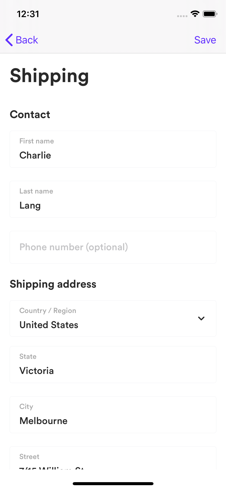
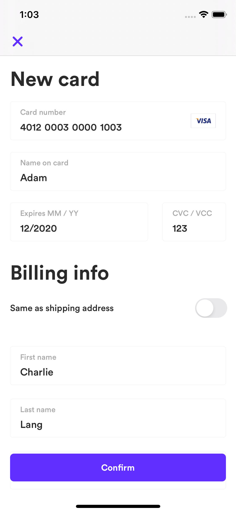
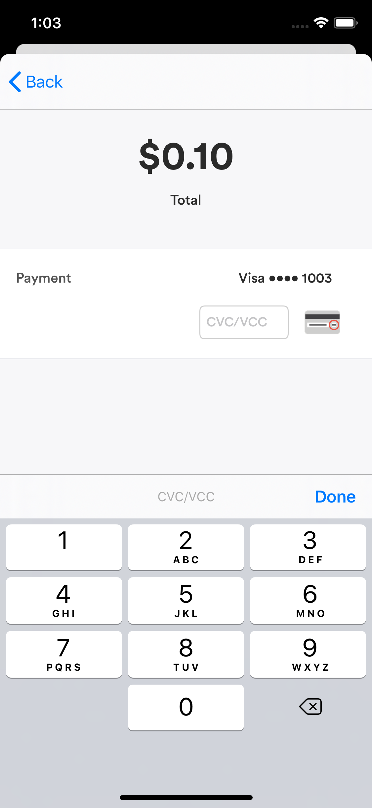

# Airwallex iOS SDK


[](https://github.com/Carthage/Carthage)
[](https://cocoapods.org)

The Airwallex iOS SDK is a framework for integrating easy, fast and secure payments inside your app with Airwallex. It provides simple functions to send sensitive credit card data directly to Airwallex, it also provides a powerful, customizable interface for collecting user payment details.

<p align="center">




</p>

Get started with our integration guide and example project.

Table of contents
=================

<!--ts-->
   * [Requirements](#requirements)
   * [Integration](#integration)
      * [CocoaPods](#cocoapods)
	  * [Carthage](#carthage)
	  * [Swift](#swift)
      * [Basic Integration](#basic-integration)
      * [Customize Usage](#customize-usage)
      * [Set Up WeChat Pay](#set-up-wechat-pay)
   * [Examples](#examples)
   * [Contributing](#contributing)
<!--te-->

## Requirements
The Airwallex iOS SDK requires Xcode 10.0 or later and is compatible with apps targeting iOS 10 or above.

## Integration

### CocoaPods

Airwallex for iOS is available through either [CocoaPods](https://cocoapods.org/) or [Carthage](https://github.com/Carthage/Carthage).

If you haven't already, install the latest version of [CocoaPods](https://cocoapods.org/).
If you don't have an existing `Podfile`, run the following command to create one:
```ruby
pod init
```
Add this line to your Podfile:
```ruby
pod 'Airwallex'
```
Run the following command
```ruby
pod install
```
Don’t forget to use the `.xcworkspace` file to open your project in Xcode, instead of the `.xcodeproj` file, from here on out.
In the feature, to update to the latest version of the SDK, just run:
```ruby
pod update Airwallex
```

### Carthage

```ogdl
github "airwallex/airwallex-payment-ios"
```

### Swift

Even though `Airwallex` is written in Objective-C, it can be used in Swift with no hassle. If you use [CocoaPods](https://cocoapods.org/),  add the following line to your [Podfile](https://guides.cocoapods.org/using/using-cocoapods.html):

```ruby
use_frameworks!
```

### Basic Integration

When your app starts, configure the SDK with your Airwallex `baseURL`.

```objective-c
[Airwallex setDefaultBaseURL:[NSURL URLWithString:@”Airwallex payment base URL”]];
```

- Create a payment intent

When the customer wants to checkout an order, you should create a payment intent on your server-side and then pass the id and client_secret to the mobile-side to confirm the payment intent with the payment method selected.

- Handle the payment flow

In your checkout screen, add a button to let the customer enter or change their payment method. When tapped, use `AWUIContext` to present the payment flow.

```objective-c
AWUIContext *context = [AWUIContext sharedContext];
context.delegate = ”The target to handle AWPaymentResultDelegate protocol”;
context.hostViewController = “The host viewController present or push the payment UIs”;
context.paymentIntent = “The payment intent merchant provides”;
context.shipping = “The shipping address merchant provides”;
[context presentPaymentFlow];
```

- Handle the payment result

After the user completes the payment successfully or with error, you need to handle the payment result.

```objective-c
/**
 A delegate which handles checkout results.
 */
@protocol AWPaymentResultDelegate <NSObject>
 
/**
 This method is called when the user has completed the checkout.
 
 @param controller The controller handling payment result.
 @param status The status of checkout result.
 @param error The error if checkout failed.
 */
- (void)paymentViewController:(UIViewController *)controller didFinishWithStatus:(AWPaymentStatus)status error:(nullable NSError *)error;
 
/**
 This method is called when the user has completed the checkout with wechat pay.
 
 @param controller The controller handling payment result.
 @param response The wechat object.
 */
- (void)paymentViewController:(UIViewController *)controller nextActionWithWeChatPaySDK:(AWWeChatPaySDKResponse *)response;
 
@end
```

### Customize Usage

- Customize the usage of shipping info

Use `AWUIContext` to get an instance of `AWShippingViewController` and show it contained in a `UINavigationController`.

```objective-c
AWShippingViewController *controller = [AWUIContext shippingViewController];
controller.delegate = "The target to handle AWShippingViewControllerDelegate protocol";
controller.shipping = "The shipping address merchant provides";
UINavigationController *navigationController = [[UINavigationController alloc] initWithRootViewController:controller];
[self presentViewController:navigationController animated:YES completion:nil];
```

- Handle the shipping result

```objective-c
/**
 A delegate which handles selected shipping.
 */
@protocol AWShippingViewControllerDelegate <NSObject>
 
/**
 This method is called when a shipping has been saved.
 
 @param controller The shipping view controller.
 @param shipping The selected shipping.
 */
- (void)shippingViewController:(AWShippingViewController *)controller didEditShipping:(AWPlaceDetails *)shipping;
 
@end
```

- Customize the usage of card creation

Use `AWUIContext` to get an instance of `AWCardViewController` and show it contained in a `UINavigationController`.

```objective-c
AWCardViewController *controller = [AWUIContext newCardViewController];
controller.delegate = "The target to handle AWCardViewControllerDelegate protocol";
controller.customerId = "The customer id merchant provides";
controller.sameAsShipping = YES;
controller.shipping = "The shipping address merchant provides";
UINavigationController *navigationController = [[UINavigationController alloc] initWithRootViewController:controller];
[self presentViewController:navigationController animated:YES completion:nil];
```

- Handle new card result

```objective-c
/**
 A delegate which handles card creation.
 */
@protocol AWCardViewControllerDelegate <NSObject>
 
/**
 This method is called when a card has been created and saved to backend.
 
 @param controller The new card view controller.
 @param paymentMethod The saved card.
 */
- (void)cardViewController:(AWCardViewController *)controller didCreatePaymentMethod:(AWPaymentMethod *)paymentMethod;
 
@end
```

- Customize the usage of payment detail

Use `AWUIContext` to get an instance of `AWPaymentViewController` and show it contained in a `UINavigationController`.

```objective-c
AWPaymentViewController *controller = [AWUIContext paymentDetailViewController];
controller.delegate = "The target to handle AWPaymentResultDelegate protocol";
controller.paymentIntent = "The payment intent merchant provides";
controller.paymentMethod = "The payment method merchant provides";
UINavigationController *navigationController = [[UINavigationController alloc] initWithRootViewController:controller];
[self presentViewController:navigationController animated:YES completion:nil];
```

- Customize the usage of confirming payment intent

Please set client secret before using `AWAPIClient` to send a request.

```objective-c
[AWAPIClientConfiguration sharedConfiguration].clientSecret = "The client secret merchant provides";
```

```objective-c
AWConfirmPaymentIntentRequest *request = [AWConfirmPaymentIntentRequest new];
request.intentId = "The payment intent id merchant provides";
request.paymentMethod = "The payment method merchant provides";
AWPaymentMethodOptions *options = [AWPaymentMethodOptions new];
options.autoCapture = YES;
options.threeDsOption = NO;
request.options = options;
request.requestId = NSUUID.UUID.UUIDString;

AWAPIClient *client = [[AWAPIClient alloc] initWithConfiguration:[AWAPIClientConfiguration sharedConfiguration]];
[client send:request handler:^(id<AWResponseProtocol>  _Nullable response, NSError * _Nullable error) {
	if (error) {
		return;
	}
 
	AWConfirmPaymentIntentResponse *result = (AWConfirmPaymentIntentResponse *)response;
	// Handle the payment result.
}];
```

### Set Up WeChat Pay

Note: you can follow this official guide [WeChat In-App Pay](https://pay.weixin.qq.com/wiki/doc/api/wxpay/pay/In-AppPay/chapter6_2.shtml).

1. After the Merchant has successfully applied for an App in the WeChat Open Platform, the Platform will provide an unique APPID to the Merchant. When creating a project in Xcode, the developer should enter the APPID value in the “URL Schemes” field.

2. Before calling the API, you should register your APPID with WeChat.

```objective-c
[WXApi registerApp:@"Wechat app id" enableMTA:YES];
```

3. The merchant's server calls the Unified Order API to create an advanced transaction. After obtaining prepay_id and signing relevant parameters, the advanced transaction data is transferred to the app to start a payment.

```objective-c
- (void)paymentWithWechatPaySDK:(AWWeChatPaySDKResponse *)response
{
	PayReq *request = [[PayReq alloc] init];
	request.partnerId = response.partnerId;
	request.prepayId = response.prepayId;
	request.package = response.package;
	request.nonceStr = response.nonceStr;
	request.timeStamp = response.timeStamp.doubleValue;
	request.sign = response.sign;

	[WXApi sendReq:request];
}
```

4. After completing payment, WeChat will be redirected to the merchant's app and do a callback using onResp(), then it can retrieve the payment intent status after the merchant server is notified, so please keep listening to the notification.

```objective-c
- (void)onResp:(BaseResp *)resp
{
	if ([resp isKindOfClass:[PayResp class]]) {
		PayResp *response = (PayResp *)resp;
		switch (response.errCode) {
			case WXSuccess:
				[SVProgressHUD showSuccessWithStatus:@"Succeed to pay"];
				break;
			default:
				[SVProgressHUD showErrorWithStatus:@"Failed to pay"];
				break;
		}
	}
}
```

## Examples

To run the example project, you should follow these steps.

- Preparing

1. Install the [lastest version](https://itunes.apple.com/us/app/xcode/id497799835?mt=12) of Xcode and iOS SDK from Mac Store.

2. Install [Bundle](https://bundler.io/)

```ruby
gem install bundler
```

- Clone source code

Run the following script to clone this project to your local disk.

```
git clone git@github.com:airwallex/airwallex-payment-ios.git
```

- Install dependencies and open project

1. Go into the project directory

```
cd airwallex-payment-ios
```

2. Install dependencies

```
bundle install
```

```
pod install
```

3. Open `Airwallex.xcworkspace` from Xcode or run the following script to open it. **Be sure you always open the project from the work space.**

```
open Airwallex.xcworkspace
```

- Build Configurations

There are two schemes `Airwallex` and `Examples`. You can switch the schemes in project scheme settings.

`Airwallex` will generate a framework for developer

`Examples` will build and run an example application

- Run the app on your iOS device

Select your target device from the top left panel, then press "Command + R" on your keyboard (or "Product > Run" from the top menu bar) to run this project on your iOS device.

## Contributing

We welcome contributions of any kind including new features, bug fixes, and documentation improvements. The best way to contribute is by submitting a pull request – we'll do our best to respond to your patch as soon as possible. You can also submit an issue if you find bugs or have any questions.
