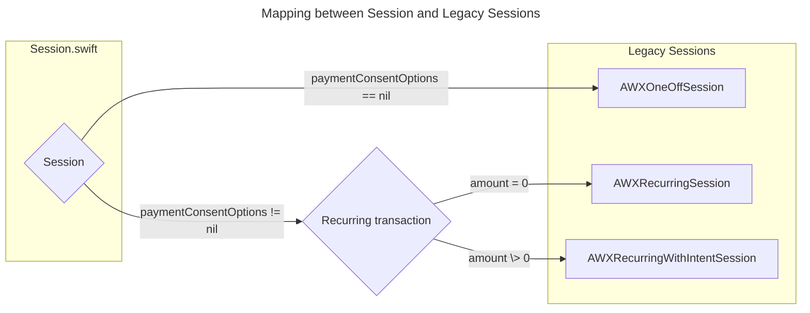

# Airwallex iOS SDK


[](https://cocoapods.org)

- [Chinese Tutorial](README_zh_CN.md)

## Overview
The Airwallex iOS SDK is a flexible tool that enables you to integrate payment methods into your iOS app. It provides native UI screens to facilitate payment functions on top of your existing purchase flow. You can also choose to build your own custom UI using API integration.

We support the following localizations: English, Chinese Simplified, Chinese Traditional, French, German, Japanese, Korean, Portuguese Portugal, Portuguese Brazil, Russian, Spanish, Thai

<p align="left">


</p>

Table of contents
=================

<!--ts-->
- [Getting Started](#getting-started)
- [Requirements](#requirements)
- [Examples](#examples)
- [Integration](#integration)
  - [Installation](#installation)
    - [Swift Package Manager](#swift-package-manager)
    - [CocoaPods](#cocoapods)
  - [Required Setup](#required-setup)
    - [Customer ID](#customer-id)
    - [Payment Intent](#payment-intent)
    - [Client Secret](#client-secret)
    - [Payment session](#payment-session)
  - [Optional Setup](#optional-setup)
    - [WeChat Pay](#wechat-pay)
    - [Apple Pay](#apple-pay)
  - [UI Integration](#ui-integration)
    - [Launch Payment Sheet (Recommended)](#launch-payment-sheet-recommended)
    - [Launch Card Payment Directly](#launch-card-payment-directly)
    - [Launch Payment Method by Name](#launch-payment-method-by-name)
    - [Customize Theme Color (optional)](#customize-theme-color-optional)
  - [Low-level API Integration](#low-level-api-integration)
    - [Create PaymentSessionHandler](#create-paymentsessionhandler)
    - [Pay with card](#pay-with-card)
    - [Pay with saved card (consent)](#pay-with-saved-card-consent)
    - [Pay with Apple Pay](#pay-with-apple-pay)
    - [Pay with Redirect](#pay-with-redirect)
  - [Handle Payment Result](#handle-payment-result)
- [Contributing](#contributing)
<!--te-->

## Getting Started
Follow our [integration guide](#integration) and explore the [example project](#examples) to quickly set up payments using the Airwallex SDK.
> [!TIP] 
> Updating to a newer version of the SDK? See our [migration guide](MIGRATION.md)

## Requirements
- iOS 13.0+
- Xcode 15.4+ (For older Xcode versions, refer to release 5.4.3)

## Examples

The Examples can be run on the latest Xcode. To run the example app, you should follow these steps.

- Clone source code

```
git clone git@github.com:airwallex/airwallex-payment-ios.git
```

- Install dependencies and open project

Make sure you have installed Cocoapods and then run the following command in the project directory:

```
pod install
```

> [!TIP] 
> Update key file (Optional)
>- In the `Examples/Keys` folder, edit `Keys.json` with proper keys.
>- Build and run `Examples` schema
>
> The key file provides default values for settings. You can update these settings anytime using the in-app settings screen.

## Integration

### Installation

#### Swift Package Manager
Airwallex for iOS is available via Swift Package Manager. To integrate it into your project, follow these steps:
1. Follow [Apple's guide](https://developer.apple.com/documentation/xcode/adding_package_dependencies_to_your_app) on how to add a package dependency in Xcode.

2. Use the following URL for the Airwallex package:
https://github.com/airwallex/airwallex-payment-ios

3. Ensure you specify version 6.1.1 or later.

You can add `Airwallex` for a comprehensive integration that includes everything except WeChat Pay. Alternatively, you can selectively add specific products to your project for a more modular setup, depending on your payment needs:

- `AirwallexPaymentSheet`: For UI integration. 
- `AirwallexPayment`: For low-level API integration.
- `AirwallexWeChatPay`: Required for WeChat Pay integration.

**Size Impact**

| Integration Style| Components Included | IPA Size Increase |
|-----------------|----------------------|------------------:|
| Low-Level API Integration | AirwallexCore <br> AirwallexPayment | 428KB  |
| UI Integration | AirwallexCore  <br> AirwallexPayment <br> AirwallexPaymentSheet | 1.2 MB |
| Full Integration | AirwallexCore  <br> AirwallexPayment  <br> AirwallexPaymentSheet  <br> AirwallexWeChatPay | 1.4 MB |

> The above size increase (compressed) was calculated based on Xcode’s App Thinning Size Report for a minimal iOS project integrating AirwallexSDK via Swift Package Manager (SPM).
#### CocoaPods

Airwallex for iOS is available via [CocoaPods](https://cocoapods.org/).

You can add `Airwallex` for a comprehensive integration that includes everything except WeChat Pay:
```ruby
pod 'Airwallex', '~> 6.1.1'
```

Alternatively, you can selectively add specific products to your project for a more modular setup, depending on your payment needs:
```ruby
pod 'Airwallex/AirwallexPaymentSheet' # For UI integration. 
pod 'Airwallex/AirwallexPayment' # For low-level API integration
pod 'Airwallex/AirwallexWeChatPay' # Required for WeChat Pay integration
```

Run the following command:
```ruby
pod install
```

### Required Setup

When your app starts, configure the SDK with `mode`.

``` swift
Airwallex.setMode(.demoMode) // .demoMode, .stagingMode, .productionMode
```
---
#### Customer ID 

Generate or retrieve a customer ID for your user on your server-side. 
Refer to the [Airwallex API Doc](https://www.airwallex.com/docs/api#/Payment_Acceptance/Customers/) for more details

> [!NOTE]
> If you only support guest checkout, you can skip this step
---
#### Payment Intent

The Payment Intent is a required object for all transaction modes in the Airwallex iOS SDK. 
It represents a specific payment attempt and must be created before initiating a payment from the mobile app.
Create payment intent on your **server-side** and then pass the payment intent to the mobile-side to confirm the payment intent with the payment method selected.

Please refer to the [Airwallex API Doc](https://www.airwallex.com/docs/api#/Payment_Acceptance/Payment_Intents/) for details of the payment intent API.

While creating payment intent using `payment_intents/create`:
- If **amount = 0**, only a payment consent will be created (no funds will be deducted).
- If **amount > 0**, a payment consent will be created and a deduction will be made at the same time.
- For guest checkout, `customer_id` parameter can be omitted.

---
#### Client Secret

If you are using `Session` object, you don't need to manually update client secret, it will be automatically handled by the SDK internally

> [!NOTE]
> If you are using deprecated subclasses of  `AWXSession`, please refer to [integration guide 6.1.9](https://github.com/airwallex/airwallex-payment-ios/tree/6.1.9?tab=readme-ov-file#integration) 
---
#### Payment session

The new `Session` type introduced in version 6.2.0 provides a unified and simplified way for integration and there are some internal optimization as well. We recommend using `Session` instead of the legacy `AWXOneOffSession`, `AWXRecurringSession`, and `AWXRecurringWithIntentSession`.

**Option 1: Initialize with a pre-created payment intent**

``` swift
let paymentConsentOptions = if /* one-off transaction */  {
    nil
} else {
    /* recurring transaction */
    PaymentConsentOptions(
        nextTriggeredBy: ".customer/.merchant",
        merchantTriggerReason: "nil/.scheduled/.unscheduled/...."
    )
}
let session = Session(
    paymentIntent: paymentIntent, // payment intent created on your server
    countryCode: "Your country code",readme
    applePayOptions: applePayOptions, // required if you want to support apple pay
    autoCapture: true, // Only applicable for card payment. If true the payment will be captured immediately after authorization succeeds.
    billing: billing, // prefilled billing address
    paymentConsentOptions: paymentConsentOptions, // info for recurring transactions
    requiredBillingContactFields: [.name, .email], // customize billing contact fields for card payment
    returnURL: "myapp://payment/return" // App return url
)
```

**Option 2: Initialize with a payment intent provider (Express Checkout)**

Using a `PaymentIntentProvider` allows the SDK to delay payment intent creation until just before payment confirmation or when clientSecret is required to request some airwallex API. 

``` swift
// 1. Implement PaymentIntentProvider
class MyPaymentIntentProvider: NSObject, PaymentIntentProvider {
    let currency: String = "USD"
    let customerId: String? = "customer_123"

    func createPaymentIntent() async throws -> AWXPaymentIntent {
        // Call your backend to create the payment intent
        let response = try await MyBackendAPI.createPaymentIntent(
            currency: currency,
            customerId: customerId
        )
        return response.paymentIntent
    }
}

// 2. Create session with the provider
let provider = MyPaymentIntentProvider()
let session = Session(
    paymentIntentProvider: provider, // Payment intent will be created when needed
    countryCode: "US"
)
```

> [!NOTE]
> We will continue to support integrations using legacy session types until the next major version release. For integration steps, please refer to [integration guide](https://github.com/airwallex/airwallex-payment-ios/tree/6.1.9?tab=readme-ov-file#integration) 


### Optional Setup
---
#### WeChat Pay
- make sure you add dependency for `AirwallexWeChatPay` (Swift package manager) or `Airwallex/AirwallexWechatPay` (Cocoapods)
- setup `WechatOpenSDK` following the [Wechat document](https://developers.weixin.qq.com/doc/oplatform/en/Mobile_App/Access_Guide/iOS.html)

``` swift
class AppDelegate: UIResponder, UIApplicationDelegate {
    func application(_ application: UIApplication, didFinishLaunchingWithOptions launchOptions: [UIApplication.LaunchOptionsKey: Any]?) -> Bool {
        WXApi.registerApp("WeChat app ID", universalLink: "universal link of your app")
        return true
    }
    
    func application(_ app: UIApplication, open url: URL, options: [UIApplication.OpenURLOptionsKey : Any] = [:]) -> Bool {
        return WXApi.handleOpen(url, delegate: self)
    }
}

extension AppDelegate: WXApiDelegate {
    func onResp(_ resp: BaseResp) {
        if let response = resp as? PayResp {
            switch response.errCode {
                // handle payment result
            }
        }
    }
}
```
After completing payment, WeChat will be redirected to the merchant's app and do a callback using `onResp()`, then it can retrieve the payment intent status after the merchant server is notified, so please keep listening to the notification.
  
> [!NOTE]
> We use internal dynamic framework `WechatOpenSDKDynamic.xcframework` for WeChat Pay integration.
> which is a dynamic framework build from original `WechatOpenSDK.xcframework`  2.0.4.
> By doing this, we can
> 1. Remove unsafe flag `-ObjC`, `-all_load` from SPM target `AirwallexWeChatPay`
> 2. Stripe architecture `armv7` and `i386` which is no longer needed for modern apps.

---
#### Apple Pay

The Airwallex iOS SDK allows merchants to provide Apple Pay as a payment method to their customers. 

- Make sure Apple Pay is set up correctly in the app. 
  - For more information, refer to [Apple's official doc](https://developer.apple.com/documentation/passkit/apple_pay/setting_up_apple_pay).
- Make sure Apple Pay is enabled on your Airwallex account.
- Prepare the [Merchant Identifier](https://developer.apple.com/documentation/passkit/apple_pay/setting_up_apple_pay) and configure `applePayOptions` on the payment session object.

You can customize the Apple Pay options to restrict it as well as provide extra context. For more information, please refer to the `AWXApplePayOptions.h` header file.
```swift
let options = AWXApplePayOptions(merchantIdentifier: applePayMerchantId)
options.additionalPaymentSummaryItems = [
    .init(label: "goods", amount: 10),
    .init(label: "tax", amount: 1)
]
options.merchantCapabilities = [.threeDSecure, .debit]
options.requiredBillingContactFields = [.postalAddress]
options.supportedCountries = ["AU"]
options.totalPriceLabel = "COMPANY, INC."

let session = Session(
    //  ...
    applePayOptions: options// required for Apple Pay
)
```

> [!IMPORTANT]
> Be aware that we currently support the following payment networks for Apple Pay:
>- Visa
>- MasterCard
>- ChinaUnionPay
>- Maestro
>- Amex
>- Discover
>- JCB
>
> Coupon is also not supported at this stage.


### UI Integration

#### Launch Payment Sheet (Recommended)
> [!NOTE]
> This is **recommended usage**, it builds a complete user flow on top of your app with our prebuilt UI to collect payment details, billing details, and confirming the payment.

Make sure you add dependency for `Airwallex` or `AirwallexPaymentSheet`.
Upon checkout, use [AWXUIContext](https://airwallex.github.io/airwallex-payment-ios/6.2.2/documentation/airwallex/awxuicontext) to present the payment flow where the user will be able to select the payment method.

``` swift
AWXUIContext.launchPayment(
    from: "hosting view controller which also handles AWXPaymentResultDelegate",
    session: "The session created above",
    filterBy: "An optional array of payment method names used to filter the payment methods returned by the server",
    launchStyle: ".push/.present",
    layout: ".tab/.accordion"
)
```

We provide `tab` and `accordian` styles for our payment sheet:
<p align="left">


</p>

---
#### Launch Card Payment Directly
```swift
AWXUIContext.launchCardPayment(
    from: "hosting view controller which also handles AWXPaymentResultDelegate",
    session: "The session created above",
    supportedBrands: "accepted card brands, should not be empty"
)
```

> [!Tip]
> If you want to show card payment only but still want to be able to pay with saved cards, you can launch
> payment sheet by passing `[AWXCardKey]` as parameter of `filterBy:`
``` swift
AWXUIContext.launchPayment(
    from: "hosting view controller which also handles AWXPaymentResultDelegate",
    session: "The session created above",
    filterBy: [AWXCardKey]
)
```
---
#### Launch Payment Method by Name
```swift
AWXUIContext.launchPayment(
    name: "payment method name",
    from: "hosting view controller",
    session: "The session created above",
    paymentResultDelegate: "object handles AWXPaymentResultDelegate"
)
```
> [!TIP]
> Available payment method names can be found in [Airwallex API doc](https://www.airwallex.com/docs/api#/Payment_Acceptance/Config/_api_v1_pa_config_payment_method_types/get)  
> 
---
#### Customize Theme Color (optional)

You can customize theme color of the payment sheet
``` swift
AWXTheme.shared().tintColor = .red
```

### Low-level API Integration

Make sure you add dependency for `Airwallex` or `AirwallexPayment`.
You can build your own entirely custom UI on top of our low-level APIs.

> [!NOTE]
> You still need all required steps listed in [Required Setup](#required-setup) section above to set up configurations, payment intent and payment session.
> 
> you may find [Airwallex API Docs](https://www.airwallex.com/docs/api#/Payment_Acceptance) useful if you are using this integration style
---
#### Create PaymentSessionHandler 
[PaymentSessionHandler](https://airwallex.github.io/airwallex-payment-ios/6.2.2/documentation/airwallex/paymentsessionhandler) is at the center of the API integration.
```swift
let paymentSessionHandler = PaymentSessionHandler(
    session: "The session created above", 
    viewController: "hosting view controller which also handles AWXPaymentResultDelegate"
)
// store the `paymentSessionHandler` in your view controller or class that is tied to your view's lifecycle
self.paymentSessionHandler = paymentSessionHandler
```
---
#### Pay with card
```swift
// Confirm intent with card and billing
paymentSessionHandler.startCardPayment(
    with: "The AWXCard object collected by your custom UI",
    billing: "The AWXPlaceDetails object collected by your custom UI"
)
```
---
#### Pay with saved card (consent)

- Pay with consent object - Confirm intent with a payment consent object `AWXPaymentConsent`)
``` swift
paymentSessionHandler.startConsentPayment(with: "payment consent")
```

- Pay with consent ID - Confirm intent with a valid payment consent ID only when the card is save as **network token**
``` swift
paymentSessionHandler.startConsentPayment(withId: "consent ID")
```
---
#### Pay with Apple Pay
> [!IMPORTANT]
> Make sure you have [Set Up Apple Pay](#Apple-Pay) correctly.
``` swift
paymentSessionHandler.startApplePay()
```
---
#### Pay with Redirect
> [!IMPORTANT] 
> You should provide all required fields defined in "/api/v1/pa/config/payment_method_types/${payment method name}" in `additionalInfo`
``` swift
paymentSessionHandler.startRedirectPayment(
    with: "payment method name",
    additionalInfo: "all required information"
)
```

### Handle Payment Result

Regardless of what kind of integration style you choose, you need to handle the payment result in the callback of `AWXPaymentResultDelegate`.
``` swift
func paymentViewController(_ controller: UIViewController?, didCompleteWith status: AirwallexPaymentStatus, error: Error?) {
    // call back for status success/in progress/ failure / cancel
}
```

> [!TIP]
> If the payment consent is created during payment process, you can implement this optional function to get the ID of this payment consent for any further usage.
```swift
func paymentViewController(_ controller: UIViewController?, didCompleteWithPaymentConsentId paymentConsentId: String) {
    // To do anything with this ID.
}
```

## Contributing

We welcome contributions of any kind including new features, bug fixes, and documentation improvements. The best way to contribute is by submitting a pull request – we'll do our best to respond to your patch as soon as possible. You can also submit an issue if you find bugs or have any questions.

