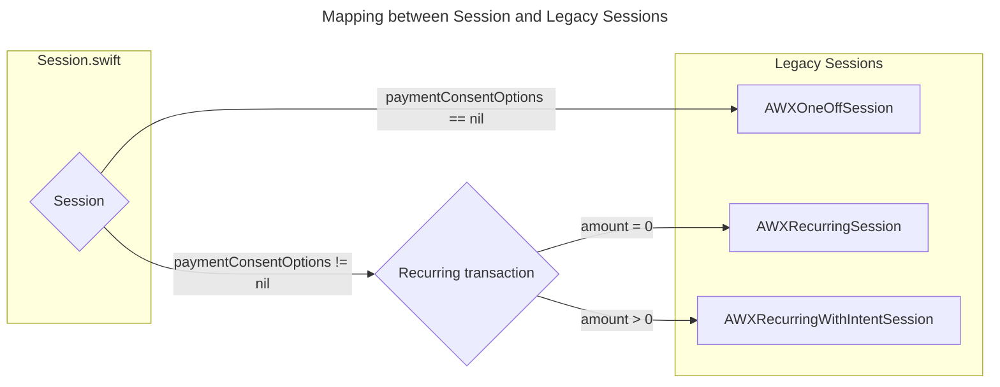

# Airwallex iOS SDK

[English](README.md) | [中文](README_zh_CN.md)


[](https://cocoapods.org)

## Overview

The Airwallex iOS SDK lets you add payment methods to your iOS app. Use the prebuilt native UI on top of your existing checkout flow, or build a custom UI with the low-level APIs.

Supported localizations: English, Simplified Chinese, Traditional Chinese, French, German, Japanese, Korean, Portuguese (Portugal), Portuguese (Brazil), Russian, Spanish, and Thai.

## Supported Payment Methods

| Category | Methods | Notes |
|----------|---------|-------|
| Cards | Visa, Mastercard, UnionPay, Discover, JCB, Diners Club, Amex | PCI-DSS compliance is required when using low-level API integration |
| Apple Pay | Apple Pay | [Setup](#apple-pay) |
| E-Wallets | Alipay, AlipayHK, DANA, GCash, Kakao Pay, Touch 'n Go, WeChat Pay, and [more](https://www.airwallex.com/docs/payments__payment-methods__payment-methods-overview) | |

## Integration Options

Choose the integration option that best suits your needs:

| Option | Description | Multiple payment methods | Single payment method |
|--------|-------------|--------------------------|------------------------|
| [UI Integration - Hosted Payment Page (HPP)](#ui-integration---hpp-hosted-payment-page) | Launch a complete, SDK-managed payment flow with prebuilt screens for payment method selection, card input, and checkout. Supports customizable theming and dark mode. **Recommended for most use cases.** |  |  |
| [UI Integration - Embedded Element](#ui-integration---embedded) | Embed Airwallex's `AWXPaymentElement` directly into your own view hierarchy using UIKit. You retain full control over the host layout and navigation while leveraging the SDK's payment UI components. |  |  |
| [Low-level API Integration](#low-level-api-integration) | Build a fully custom payment UI using the SDK's core APIs. Gives you direct access to payment method retrieval, card tokenization, payment confirmation, and consent management. |  |  |

## Contents

- [Getting Started](#getting-started)
- [Requirements](#requirements)
- [Examples](#examples)
- [Integration](#integration)
  - [Installation](#installation)
    - [Swift Package Manager](#swift-package-manager)
    - [CocoaPods](#cocoapods)
  - [Required Setup](#required-setup)
    - [Customer ID](#customer-id)
    - [Payment Intent](#payment-intent)
    - [Client Secret](#client-secret)
    - [Payment Session](#payment-session)
  - [Optional Setup](#optional-setup)
    - [WeChat Pay](#wechat-pay)
    - [Apple Pay](#apple-pay)
  - [UI Integration - Hosted Payment Page (HPP)](#ui-integration---hosted-payment-page-hpp)
    - [Launch Payment Sheet (Recommended)](#launch-payment-sheet-recommended)
    - [Launch Card Payment Directly](#launch-card-payment-directly)
    - [Launch Payment Method by Name](#launch-payment-method-by-name)
    - [Configuration Options](#configuration-options)
    - [Select the Payment UI Language](#select-the-payment-ui-language)
    - [Handle Payment Result](#handle-payment-result)
  - [UI Integration - Embedded](#ui-integration---embedded)
    - [Create Embedded Payment Sheet](#create-embedded-payment-sheet)
    - [Create Embedded Card Element](#create-embedded-card-element)
    - [Configuration Options](#configuration-options-1)
    - [Handle Payment Element Events](#handle-payment-element-events)
  - [Low-level API Integration](#low-level-api-integration)
    - [Create PaymentSessionHandler](#create-paymentsessionhandler)
    - [Pay with Card](#pay-with-card)
    - [Pay with Saved Card (Consent)](#pay-with-saved-card-consent)
    - [Pay with Apple Pay](#pay-with-apple-pay)
    - [Pay with Redirect](#pay-with-redirect)
    - [Handle Payment Result](#handle-payment-result-1)
- [Contributing](#contributing)

## Getting Started

Follow the [integration guide](#integration) and explore the [example project](#examples) to set up payments with the Airwallex iOS SDK.

> [!TIP]
> Updating to a newer version of the SDK? See the [migration guide](MIGRATION.md).

## Requirements

- iOS 13.0+
- Xcode 15.4+ (For older Xcode versions, refer to release 5.4.3)

## Examples


The example app can be run with the latest Xcode. Follow these steps:

1. Clone the repository:

```bash
git clone git@github.com:airwallex/airwallex-payment-ios.git
```

2. Install dependencies and open the project. Make sure CocoaPods is installed, then run:

```bash
pod install
```

> [!TIP]
> Updating keys (optional)
> - In `Examples/Keys`, edit `Keys.json` with your keys.
> - Build and run the `Examples` scheme.
>
> `Keys.json` provides default settings. You can change them anytime from the in-app settings screen.

## Integration

### Installation

#### Swift Package Manager

Airwallex for iOS is available via Swift Package Manager. To add it to your project:

1. Follow [Apple's guide](https://developer.apple.com/documentation/xcode/adding_package_dependencies_to_your_app) to add a package dependency in Xcode.
2. Use this package URL: `https://github.com/airwallex/airwallex-payment-ios`
3. Specify version **6.1.1** or later.

Add `Airwallex` for a full integration except WeChat Pay, or add only the products you need:

- `AirwallexPaymentSheet`: UI integration
- `AirwallexPayment`: low-level API integration
- `AirwallexWeChatPay`: required for WeChat Pay

**Size impact**

| Integration style | Components included | IPA size increase |
|-------------------|---------------------|------------------:|
| Low-level API | AirwallexCore <br> AirwallexPayment | 0.4 MB |
| UI | AirwallexCore <br> AirwallexPayment <br> AirwallexPaymentSheet | 1.3 MB |
| Full | AirwallexCore <br> AirwallexPayment <br> AirwallexPaymentSheet <br> AirwallexWeChatPay | 1.5 MB |

> Compressed size increase from Xcode’s App Thinning Size Report for a minimal iOS project that integrates Airwallex via Swift Package Manager.

#### CocoaPods

Airwallex for iOS is also available via [CocoaPods](https://cocoapods.org/).

Add `Airwallex` for a full integration except WeChat Pay:

```ruby
pod 'Airwallex', '~> 6.7.0'
```

Or add only the subspecs you need:

```ruby
pod 'Airwallex/AirwallexPaymentSheet' # UI integration
pod 'Airwallex/AirwallexPayment' # low-level API integration
pod 'Airwallex/AirwallexWeChatPay' # required for WeChat Pay
```

Then run:

```bash
pod install
```

### Required Setup

When your app starts, configure the SDK mode:

```swift
Airwallex.setMode(.demoMode) // .demoMode, .previewMode, .stagingMode, .productionMode
```

#### Customer ID

Generate or retrieve a customer ID on your server. See the [Airwallex API docs](https://www.airwallex.com/docs/api#/Payment_Acceptance/Customers/) for details.

> [!NOTE]
> If you only support guest checkout, you can skip this step.

#### Payment Intent

A Payment Intent is required for all transaction modes. It represents a payment attempt and must be created before the mobile app confirms payment.

Create the payment intent on your **server**, then pass it to the app so the selected payment method can confirm it. See the [Airwallex API docs](https://www.airwallex.com/docs/api#/Payment_Acceptance/Payment_Intents/).

When calling `payment_intents/create`:

- If **amount = 0**, only a payment consent is created (no funds are deducted).
- If **amount > 0**, a payment consent is created and a deduction is made at the same time.
- For guest checkout, `customer_id` can be omitted.

#### Client Secret

If you use the `Session` object, you do not need to update the client secret yourself. The SDK handles it.

> [!NOTE]
> If you still use the deprecated `AWXSession` subclasses, see the [6.1.9 integration guide](https://github.com/airwallex/airwallex-payment-ios/tree/6.1.9?tab=readme-ov-file#integration).

#### Payment Session

`Session` (introduced in 6.2.0) is the recommended way to integrate. Prefer it over the legacy `AWXOneOffSession`, `AWXRecurringSession`, and `AWXRecurringWithIntentSession`.

**Option 1: Initialize with a pre-created payment intent**

```swift
let paymentConsentOptions = if /* one-off transaction */ {
    nil
} else {
    /* recurring transaction */
    PaymentConsentOptions(
        nextTriggeredBy: ".customer/.merchant",
        merchantTriggerReason: "nil/.scheduled/.unscheduled/...."
    )
}
let session = Session(
    paymentIntent: paymentIntent, // payment intent created on your server
    countryCode: "Your country code",
    applePayOptions: applePayOptions, // required if you want to support Apple Pay
    autoCapture: true, // card only: capture immediately after authorization succeeds
    billing: billing, // prefilled billing address
    paymentConsentOptions: paymentConsentOptions, // recurring transaction info
    requiredBillingContactFields: [.name, .email], // billing fields for card payment
    returnURL: "myapp://payment/return" // app return URL
)
```

**Option 2: Initialize with a payment intent provider (express checkout)**

A `PaymentIntentProvider` lets the SDK delay payment intent creation until just before confirmation, or until a `clientSecret` is needed for an Airwallex API call.

```swift
// 1. Implement PaymentIntentProvider
class MyPaymentIntentProvider: NSObject, PaymentIntentProvider {
    let amount = NSDecimalNumber(string: "99.99")
    let currency: String = "USD"
    let customerId: String? = "customer_123"

    func createPaymentIntent() async throws -> AWXPaymentIntent {
        // Call your backend to create the payment intent
        let response = try await MyBackendAPI.createPaymentIntent(
            amount: amount,
            currency: currency,
            customerId: customerId
        )
        return response.paymentIntent
    }
}

// 2. Create session with the provider
let provider = MyPaymentIntentProvider()
let session = Session(
    paymentIntentProvider: provider, // payment intent is created when needed
    countryCode: "US"
)
```

> [!NOTE]
> Legacy session types remain supported until the next major release. See the [6.1.9 integration guide](https://github.com/airwallex/airwallex-payment-ios/tree/6.1.9?tab=readme-ov-file#integration). 

```mermaid
---
title: Mapping between Session and Legacy Sessions
---
flowchart LR
    A{Session}
    B1[AWXOneOffSession]
    B2{Recurring transaction}
    C1[AWXRecurringSession]
    C2[AWXRecurringWithIntentSession]

subgraph Session.swift
    A
end 

A -- paymentConsentOptions == nil --> B1
A -- paymentConsentOptions != nil --> B2

subgraph Legacy Sessions
    B1;C1;C2
end

B2 -- amount = 0 --> C1
B2 -- amount > 0 --> C2
```

### Optional Setup

#### WeChat Pay

- Add the `AirwallexWeChatPay` (Swift Package Manager) or `Airwallex/AirwallexWeChatPay` (CocoaPods) dependency.
- Set up `WechatOpenSDK` using the [WeChat iOS guide](https://developers.weixin.qq.com/doc/oplatform/en/Mobile_App/Access_Guide/iOS.html).

```swift
class AppDelegate: UIResponder, UIApplicationDelegate {
    func application(_ application: UIApplication, didFinishLaunchingWithOptions launchOptions: [UIApplication.LaunchOptionsKey: Any]?) -> Bool {
        WXApi.registerApp("WeChat app ID", universalLink: "universal link of your app")
        return true
    }
    
    func application(_ app: UIApplication, open url: URL, options: [UIApplication.OpenURLOptionsKey : Any] = [:]) -> Bool {
        return WXApi.handleOpen(url, delegate: self)
    }
}

extension AppDelegate: WXApiDelegate {
    func onResp(_ resp: BaseResp) {
        if let response = resp as? PayResp {
            switch response.errCode {
                // handle payment result
            }
        }
    }
}
```
After payment, WeChat returns to the merchant app and calls `onResp()`. Keep listening for this callback, then retrieve payment intent status after your server is notified.

> [!NOTE]
> WeChat Pay uses `WechatOpenSDKDynamic.xcframework`, a dynamic rebuild of `WechatOpenSDK.xcframework` 2.0.4. This lets us:
> 1. Remove the unsafe `-ObjC` and `-all_load` flags from the SPM target `AirwallexWeChatPay`
> 2. Drop the `armv7` and `i386` architectures, which modern apps no longer need

#### Apple Pay

The SDK can present Apple Pay as a payment method.

- Set up Apple Pay in the app. See [Apple's documentation](https://developer.apple.com/documentation/passkit/apple_pay/setting_up_apple_pay).
- Enable Apple Pay on your Airwallex account.
- Prepare a [Merchant Identifier](https://developer.apple.com/documentation/passkit/apple_pay/setting_up_apple_pay) and set `applePayOptions` on the payment session.

You can restrict payment networks and add extra context. See `AWXApplePayOptions.h` for all options.
```swift
let options = AWXApplePayOptions(merchantIdentifier: applePayMerchantId)
options.additionalPaymentSummaryItems = [
    .init(label: "goods", amount: 10),
    .init(label: "tax", amount: 1)
]
options.merchantCapabilities = [.threeDSecure, .debit]
options.requiredBillingContactFields = [.postalAddress]
options.supportedCountries = ["AU"]
options.totalPriceLabel = "COMPANY, INC."

let session = Session(
    //  ...
    applePayOptions: options // required for Apple Pay
)
```

> [!IMPORTANT]
> Supported Apple Pay networks:
> - Visa
> - Mastercard
> - China UnionPay
> - Maestro
> - Amex
> - Discover
> - JCB
>
> Coupons are not supported.


### UI Integration - Hosted Payment Page (HPP)

#### Launch Payment Sheet (Recommended)

> [!NOTE]
> This is the **recommended** flow: a complete, prebuilt UI that collects payment and billing details and confirms the payment.

Add the `Airwallex` or `AirwallexPaymentSheet` dependency. At checkout, use [AWXUIContext](https://airwallex.github.io/airwallex-payment-ios/6.7.0/documentation/airwallex/awxuicontext) to present the payment method picker.

```swift
let configuration = AWXUIContext.Configuration()
configuration.layout = .tab // or .accordion
configuration.launchStyle = .push // or .present

AWXUIContext.launchPayment(
    from: "hosting view controller which also handles AWXPaymentResultDelegate",
    session: "The session created above",
    configuration: configuration
)
```

We provide `tab` and `accordion` layouts for the payment sheet:

<p align="left">


</p>

#### Launch Card Payment Directly
```swift
let configuration = AWXUIContext.Configuration()
configuration.elementType = .addCard
configuration.supportedCardBrands = [.visa, .mastercard, .unionPay]

AWXUIContext.launchPayment(
    from: "hosting view controller which also handles AWXPaymentResultDelegate",
    session: "The session created above",
    configuration: configuration
)
```

> [!TIP]
> To show only card payment while still allowing saved cards, filter with `session.paymentMethods = [AWXCardKey]`:
```swift
let session = Session(...)
session.paymentMethods = [AWXCardKey]

AWXUIContext.launchPayment(
    from: "hosting view controller which also handles AWXPaymentResultDelegate",
    session: session,
    configuration: AWXUIContext.Configuration()
)
```

#### Launch Payment Method by Name
```swift
let configuration = AWXUIContext.Configuration()
configuration.elementType = .component
configuration.paymentMethodName = "payment method name"

AWXUIContext.launchPayment(
    from: "hosting view controller",
    session: "The session created above",
    paymentResultDelegate: "object handles AWXPaymentResultDelegate",
    configuration: configuration
)
```
> [!TIP]
> Payment method names are listed in the [Airwallex API docs](https://www.airwallex.com/docs/api#/Payment_Acceptance/Config/_api_v1_pa_config_payment_method_types/get).

#### Configuration Options

| Property | Description | Default |
|----------|-------------|---------|
| `elementType` | `.paymentSheet` (all methods), `.addCard` (card only), or `.component` (single method) | `.paymentSheet` |
| `paymentMethodName` | Payment method name (required for `.component`) | `nil` |
| `layout` | `.tab` or `.accordion` (only applies to `.paymentSheet`) | `.tab` |
| `launchStyle` | `.push` or `.present` | `.push` |
| `supportedCardBrands` | Accepted card brands (only applies to `.addCard`) | All available brands |
| `applePayButton` | Customize Apple Pay button appearance (e.g. `buttonType`, `disableCardArt`) | — |
| `checkoutButton` | Customize checkout button (e.g. `title`) | — |

#### Select the Payment UI Language

Set `lang` on the session before presenting a payment sheet or creating an embedded payment element. Use a best-effort BCP-47 language identifier to control the language used for SDK UI.

```swift
session.lang = "fr"
```

Regional and script variants such as `"ja-JP"` and `"zh-Hant"` are negotiated against the languages shipped by the SDK. Nil or empty values use the host application's preferred localization, and unsupported values fall back to English. Recreate the payment sheet or embedded element after changing `lang`.

#### Handle Payment Result

Handle the result in `AWXPaymentResultDelegate`:
```swift
func paymentViewController(_ controller: UIViewController?, didCompleteWith status: AirwallexPaymentStatus, error: Error?) {
    // call back for status success/in progress/ failure / cancel
}
```

> [!TIP]
> If a payment consent is created during payment, implement this optional method to receive its ID.
```swift
func paymentViewController(_ controller: UIViewController?, didCompleteWithPaymentConsentId paymentConsentId: String) {
    // To do anything with this ID.
}
```

### UI Integration - Embedded

`AWXPaymentElement` embeds payment UI in your own view hierarchy.
Unlike `AWXUIContext.launchPayment()`, which presents a full payment sheet, `AWXPaymentElement` returns a `UIView` you can place anywhere.

Add the `Airwallex` or `AirwallexPaymentSheet` dependency.

Tab and accordion layouts are available for the embedded payment sheet:

<p align="left">


</p>

> [!NOTE]
> - The embedded view needs Auto Layout constraints for sizing.
> - Height updates automatically with content.
> - Keyboard handling is the host app's responsibility.

#### Create Embedded Payment Sheet

Display a list of available payment methods inside your own view hierarchy.

```swift
let configuration = AWXPaymentElement.Configuration()
configuration.layout = .tab // or .accordion

let element = try await AWXPaymentElement.create(
    session: session,
    delegate: self, // AWXPaymentElementDelegate
    configuration: configuration
)

// Add the element's view to your view hierarchy
let paymentView = element.view
paymentView.translatesAutoresizingMaskIntoConstraints = false
containerView.addSubview(paymentView)
```

#### Create Embedded Card Element

Display only the card payment form for adding new cards.

```swift
let configuration = AWXPaymentElement.Configuration()
configuration.elementType = .addCard
configuration.supportedCardBrands = [.visa, .mastercard, .unionPay] // defaults to all available brands

let element = try await AWXPaymentElement.create(
    session: session,
    delegate: self, // AWXPaymentElementDelegate
    configuration: configuration
)

// Add the element's view to your view hierarchy
let paymentView = element.view
paymentView.translatesAutoresizingMaskIntoConstraints = false
containerView.addSubview(paymentView)
```

#### Configuration Options

| Property | Description | Default |
|----------|-------------|---------|
| `elementType` | `.paymentSheet` (all payment methods) or `.addCard` (card only) | `.paymentSheet` |
| `layout` | `.tab` or `.accordion` (only applies to `.paymentSheet`) | `.tab` |
| `supportedCardBrands` | Accepted card brands (only applies to `.addCard`) | All available brands |
| `applePayButton` | Customize Apple Pay button appearance (e.g. `showsAsPrimaryButton`, `buttonType`, `disableCardArt`) | — |
| `checkoutButton` | Customize checkout button (e.g. `title`) | — |
| `appearance.tintColor` | Primary brand color used throughout the payment element | SDK default |

#### Handle Payment Element Events

Implement `AWXPaymentElementDelegate` to receive payment lifecycle callbacks from the embedded element.

```swift
extension YourViewController: AWXPaymentElementDelegate {
    // Required - called when payment completes
    func paymentElement(
        _ element: AWXPaymentElement,
        didCompleteFor paymentMethod: String,
        with status: AirwallexPaymentStatus,
        error: Error?
    ) {
        // call back for status success/in progress/ failure / cancel
    }

    // Optional - show/hide your own loading indicator
    func paymentElement(
        _ element: AWXPaymentElement,
        onProcessingStateChangedFor paymentMethod: String,
        isProcessing: Bool
    ) {
        // Show or hide loading indicator
    }

    // Optional - called when a payment consent is created
    func paymentElement(
        _ element: AWXPaymentElement,
        didCompleteFor paymentMethod: String,
        withPaymentConsentId paymentConsentId: String
    ) {
        // Store consent ID for future use
    }

    // Optional - scroll invalid input field into view
    func paymentElement(
        _ element: AWXPaymentElement,
        validationFailedFor paymentMethod: String,
        invalidInputView: UIView
    ) {
        let rect = invalidInputView.convert(invalidInputView.bounds, to: scrollView)
        scrollView.scrollRectToVisible(rect, animated: true)
    }
}
```

### Low-level API Integration

Add the `Airwallex` or `AirwallexPayment` dependency to build a fully custom UI on the low-level APIs.

> [!NOTE]
> Complete every step in [Required Setup](#required-setup). The [Airwallex API docs](https://www.airwallex.com/docs/api#/Payment_Acceptance) are useful for this integration style.

#### Create PaymentSessionHandler

[PaymentSessionHandler](https://airwallex.github.io/airwallex-payment-ios/6.7.0/documentation/airwallex/paymentsessionhandler) is the center of API integration.
```swift
let paymentSessionHandler = PaymentSessionHandler(
    session: "The session created above", 
    viewController: "hosting view controller which also handles AWXPaymentResultDelegate"
)
// store the `paymentSessionHandler` in your view controller or class that is tied to your view's lifecycle
self.paymentSessionHandler = paymentSessionHandler
```

#### Pay with Card
```swift
// Confirm intent with card and billing
paymentSessionHandler.startCardPayment(
    with: "The AWXCard object collected by your custom UI",
    billing: "The AWXPlaceDetails object collected by your custom UI"
)
```

#### Pay with Saved Card (Consent)

- Pay with a consent object (`AWXPaymentConsent`):
```swift
paymentSessionHandler.startConsentPayment(with: "payment consent")
```

- Pay with a consent ID — only when the card is saved as a **network token**:
```swift
paymentSessionHandler.startConsentPayment(withId: "consent ID")
```

#### Pay with Apple Pay

> [!IMPORTANT]
> Complete [Apple Pay setup](#apple-pay) first.
```swift
paymentSessionHandler.startApplePay()
```

#### Pay with Redirect

> [!IMPORTANT]
> Include every required field from `/api/v1/pa/config/payment_method_types/${payment method name}` in `additionalInfo`.
```swift
paymentSessionHandler.startRedirectPayment(
    with: "payment method name",
    additionalInfo: "all required information"
)
```

#### Handle Payment Result

Handle the result in `AWXPaymentResultDelegate`:
```swift
func paymentViewController(_ controller: UIViewController?, didCompleteWith status: AirwallexPaymentStatus, error: Error?) {
    // call back for status success/in progress/ failure / cancel
}
```

> [!TIP]
> If a payment consent is created during payment, implement this optional method to receive its ID.
```swift
func paymentViewController(_ controller: UIViewController?, didCompleteWithPaymentConsentId paymentConsentId: String) {
    // To do anything with this ID.
}
```

## Contributing

We welcome contributions of any kind, including features, bug fixes, and documentation. The best way to contribute is a pull request. You can also open an issue for bugs or questions.

