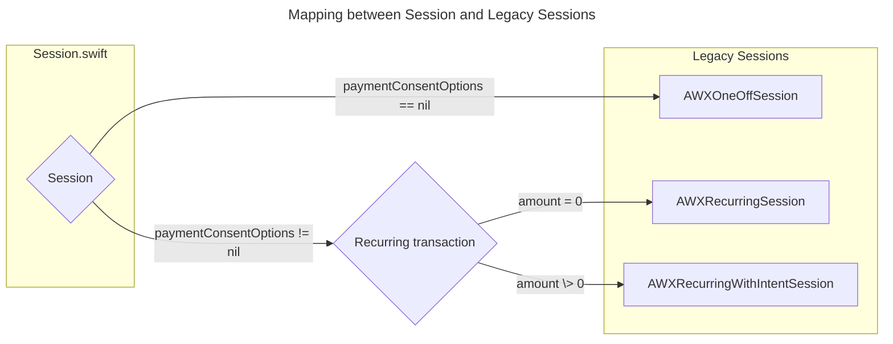

# Airwallex iOS SDK


[](https://cocoapods.org)


## 概述

Airwallex iOS SDK 是一款灵活的工具，可让您将支付方式集成到您的 iOS 应用中。它提供原生 UI 界面，方便您在现有购买流程的基础上轻松实现支付功能。您也可以选择使用 API 集成构建您自己的自定义 UI。

我们支持以下本地化语言：英语、简体中文、繁体中文、法语、德语、日语、韩语、葡萄牙语（葡萄牙）、葡萄牙语（巴西）、俄语、西班牙语、泰语。

<p align="left">


</p>

目录
<!--ts-->

- [开始集成](#开始集成)
- [要求](#要求)
- [示例项目](#示例项目)
- [集成步骤](#集成步骤)
  - [安装](#安装)
    - [Swift Package Manager](#swift-package-manager)
    - [CocoaPods](#cocoapods)
  - [必要设置](#必要设置)
    - [Customer ID](#customer-id)
    - [创建 `AWXSession`](#创建-awxsession)
    - [创建 `AWXPaymentIntent`](#创建-awxpaymentintent)
    - [设置客户端密钥](#设置客户端密钥)
  - [可选设置](#可选设置)
    - [微信支付](#微信支付)
    - [Apple Pay](#apple-pay)
  - [UI 集成](#ui-集成)
    - [启动完整支付列表（推荐）](#启动完整支付列表推荐)
    - [仅展示卡支付](#仅展示卡支付)
    - [按名称启动支付方式](#按名称启动支付方式)
    - [自定义主题色](#自定义主题色)
  - [Low-level API 集成](#low-level-api-集成)
    - [创建 PaymentSessionHandler](#创-paymentsessionhandler)
    - [使用卡支付](#使用卡支付)
    - [使用保存的卡支](#使用保存的卡支)
    - [使用 Apple Pay 支付](#使用-apple-pay-支付)
    - [使用跳转支付](#使用跳转支付)
  - [处理支付结果](#处理支付结果)
- [贡献](#贡献)
<!--te-->
=================
## 开始集成
请按照我们的[集成指南](#integration)并探索[示例项目](#examples)，以快速使用 Airwallex iOS SDK 设置支付功能。
> [!TIP] 
> 从旧版 SDK 升级的相关改动可以参考我们的[迁移文档](MIGRATION.md)

## 要求
- iOS 13.0+
- Xcode 15.4+（对于旧版本的 Xcode，请参考 5.4.3 版本）

## 示例项目

示例代码(Examples)可以在最新的 Xcode 上运行。请按照以下步骤操作。

- 克隆源代码

```
git clone git@github.com:airwallex/airwallex-payment-ios.git
```

- 安装依赖并打开项目

确保已安装 Cocoapods，然后在项目目录中运行以下命令：

```
pod install
```

> [!TIP] 
> 更新初始化设置文件（可选）
>- 更新 `Examples/Keys` 文件夹中的 `Keys.json`。
>- 构建并运行 `Examples` 
>
> `Keys.json`用于提供 Examples 项目的一些默认设置，您可以随时使用应用内的设置页面更改这些设置

## 集成步骤

### 安装

#### Swift Package Manager
Airwallex iOS SDK 支持通过 Swift Package Manager 集成。要将其集成到您的项目中，请按照以下步骤操作：
1. [按照 Apple 的指南添加包依赖。](https://developer.apple.com/documentation/xcode/adding_package_dependencies_to_your_app)
2. 使用以下 URL 获取 Airwallex 包 https://github.com/airwallex/airwallex-payment-ios
3. 使用 6.1.1 或更高版本。

您可以通过添加 `Airwallex` 集成除微信支付外的所有组件。您也可以根据您的支付需求选择性的添加组件：

- `AirwallexPaymentSheet`: 提供 UI 集成
- `AirwallexPayment`: 提供 low-level API 集成
- `AirwallexWeChatPay`: 集成微信支付，如果您需要支持微信支付请务必添加此依赖
  

**包大小**

| 集成方式| 包含的组件 | IPA 包增加的大小 |
|-----------------|----------------------|------------------:|
| Low-Level API 集成| AirwallexCore <br> AirwallexPayment | 428 MB  |
| UI 集成| AirwallexCore  <br> AirwallexPayment <br> AirwallexPaymentSheet | 1.2 MB |
| 全部组件 | AirwallexCore  <br> AirwallexPayment  <br> AirwallexPaymentSheet  <br> AirwallexWeChatPay | 1.4 MB |

> 上述 IPA 体积的增长是通过 Swift Package Manager (SPM) 使用不同方式集成 Airwallex SDK 后根据 App Thinning Size Report 中的 App size compressed 计算得到的。

---
#### CocoaPods

Airwallex iOS SDK 支持通过 [CocoaPods](https://cocoapods.org/)集成。

您可以通过添加 `Airwallex` 集成除微信支付外的所有组件。您也可以根据您的支付需求选择性的添加组件：
```ruby
pod 'Airwallex', '~> 6.1.1'
```

您也可以直接指定 `subspec` 来避免引入不需要的依赖：

```ruby
pod 'Airwallex/AirwallexPaymentSheet' # 提供 UI 集成 
pod 'Airwallex/AirwallexPayment' # 提供 low-level API 集成
pod 'Airwallex/AirwallexWeChatPay' # 集成微信支付，如果您需要支持微信支付请务必添加此依赖
```

运行以下命令：
```ruby
pod install
```
### 必要设置

当您的应用启动时，使用 `mode` 配置 SDK。

``` swift
Airwallex.setMode(.demoMode) // .demoMode, .stagingMode, .productionMode
```
---
#### Customer ID 
请在您的服务器端为您的用户生成或检索 customer ID。
相关接口信息请参阅[Airwallex API 文档](https://www.airwallex.com/docs/api#/Payment_Acceptance/Customers/)

> [!NOTE]
> 如果您的 APP 不需要签约周期/非周期扣款或在付款时进行存卡操作，您可以跳过这个步骤

---
#### 创建支付意图对象

您需要为所有交易创建 payment intent。
请在您的**服务器端**创建 payment intent，然后将 payment intent 返回到移动端。

相关接口信息请参阅 [Airwallex API 文档](https://www.airwallex.com/docs/api#/Payment_Acceptance/Payment_Intents/)

当调用 `payment_intents/create` 接口时
- **amount = 0** 表示仅签约周期/非周期扣款，不进行扣款
- **amount > 0** 表示签约周期/非周期扣款并且同时进行扣款
- 如果需要签约周期/非周期扣款或付款时进行存卡操作，请提供 `customer_id` 参数
---

#### 设置客户端密钥
将 `paymentIntent` 中的 `clientSecret` 更新到SDK中
``` swift
AWXAPIClientConfiguration.shared().clientSecret = paymentIntent.clientSecret
```

#### 创建 `Session`

``` swift
let paymentConsentOptions = if /* 单次扣款 */  {
    nil
} else {
    /* 周期/非周期扣款 */
    paymentConsentOptions(
        nextTriggeredBy: ".customer/.merchant",
        merchantTriggerReason: "nil/.scheduled/.unscheduled/...."
    )
}
let session = Session(
    paymentIntent: "payment intent create on your server",
    countryCode: "Your country code",
    applePayOptions: "required if you want to support apple pay",
    autoCapture: "Only applicable when for card payment. If true the payment will be captured immediately after authorization succeeds.",
    billing: "prefilled billing address",
    paymentConsentOptions: paymentConsentOptions,
    requiredBillingContactFields: "customize billing contact fields for card payment",
    returnURL: "App return url"
)
```

6.2.0 版本新增 `Session` 类型简化了SDK的集成方式并且进行了一些内部优化。我们建议使用 `Session` 替代已经被标记为废弃的 `AWXOneOffSession`, `AWXRecurringSession` 和 `AWXRecurringWithIntentSession`

> [!NOTE]
> 下一个大版本更新之前 Airwallex SDK 仍会继续支持 `AWXOneOffSession`, `AWXRecurringSession` 和 `AWXRecurringWithIntentSession`，具体集成方式请参考[集成文档](https://github.com/airwallex/airwallex-payment-ios/tree/6.1.9?tab=readme-ov-file#integration)



### 可选设置
#### 微信支付
- 确保添加 `AirwallexWeChatPay`（Swift package manager）或 `Airwallex/AirwallexWechatPay`（Cocoapods）的依赖
- 按照[微信官方集成文档](https://developers.weixin.qq.com/doc/oplatform/en/Mobile_App/Access_Guide/iOS.html)设置 `WechatOpenSDK`

``` swift
class AppDelegate: UIResponder, UIApplicationDelegate {
    func application(_ application: UIApplication, didFinishLaunchingWithOptions launchOptions: [UIApplication.LaunchOptionsKey: Any]?) -> Bool {
        WXApi.registerApp("WeChat app ID", universalLink: "universal link of your app")
        return true
    }
    
    func application(_ app: UIApplication, open url: URL, options: [UIApplication.OpenURLOptionsKey : Any] = [:]) -> Bool {
        return WXApi.handleOpen(url, delegate: self)
    }
}

extension AppDelegate: WXApiDelegate {
    func onResp(_ resp: BaseResp) {
        if let response = resp as? PayResp {
            switch response.errCode {
                // handle payment result
            }
        }
    }
}
```
完成支付后，微信将跳转回商户应用并回调到 `onResp()`函数。
微信 SDK 会在商户的服务端获取到获取到支付状态后更新对应 payment intent 的状态，所以请持续监听 `onResp()` 的回调
  
> [!NOTE]
> 我们使用基于 `WechatOpenSDK` 2.0.4 版本重新构建的动态框架 `WechatOpenSDKDynamic.xcframework` 进行微信支付集成。
> 通过使用重新构建的动态框架我们达到以下两个目的：
> 1. 从 SPM Target `AirwallexWeChatPay` 中移除不安全的 linker flag `-ObjC`、`-all_load`
> 2. 去除现代应用程序不再需要的 `armv7` 和 `i386` 架构。
>
---
#### Apple Pay

Airwallex iOS SDK 支持 Apple Pay 支付方式。 

- 请确保您的应用已正确设置 Apple Pay。
  - 具体步骤请参阅 Apple 的官方[文档](https://developer.apple.com/documentation/passkit/apple_pay/setting_up_apple_pay)。
- 确保您的 Airwallex 账户中已启用 Apple Pay。
- 使用您的[商户标识符](https://developer.apple.com/documentation/passkit/apple_pay/setting_up_apple_pay) 创建 `AWXApplePayOptions` 并更新到 `session.applePayOptions` 上

您可以自定义 Apple Pay 选项以对支付方式做出限制或提供额外的交易信息。全部可配置项信息请参阅 `AWXApplePayOptions.h` 头文件。
```swift
let options = AWXApplePayOptions(merchantIdentifier: applePayMerchantId)
options.additionalPaymentSummaryItems = [
    .init(label: "goods", amount: 10),
    .init(label: "tax", amount: 1)
]
options.merchantCapabilities = [.threeDSecure, .debit]
options.requiredBillingContactFields = [.postalAddress]
options.supportedCountries = ["AU"]
options.totalPriceLabel = "COMPANY, INC."

let session = Session(
    //  ...
    applePayOptions: options// required for Apple Pay
)
```

> [!IMPORTANT]
> 请注意，我们目前仅支持以下支付网络：
>- Visa
>- MasterCard
>- ChinaUnionPay
>- Maestro
>- Amex
>- Discover
>- JCB
>
> 且当前版本不支持 Coupon


### UI 集成

#### 启动完整支付列表（推荐）
> [!NOTE]
> 通过UI集成您可以在您的app中使用我们预构建的 UI 收集支付详情、账单详情并确认支付。

请确保您已经添加对 `Airwallex` 或 `AirwallexPaymentSheet` 的依赖。 在结账时使用 [AWXUIContext](https://airwallex.github.io/airwallex-payment-ios/6.2.1/documentation/airwallex/awxuicontext/) 启动支付流程，用户能够通过支付列表选择您支持的支付方式。
``` swift
AWXUIContext.launchPayment(
    from: "hosting view controller which also handles AWXPaymentResultDelegate",
    session: "The session created above",
    filterBy: "An optional array of payment method names used to filter the payment methods returned by the server",
    launchStyle: ".push/.present",
    layout: ".tab/.accordion"
)
```

我们提供了 `tab` 和 `accordian` 两种风格的支付列表:
<p align="left">


</p>

---
#### 仅展示卡支付
```swift
AWXUIContext.launchCardPayment(
    from: "hosting view controller which also handles AWXPaymentResultDelegate",
    session: "The session created above",
    supportedBrands: "accepted card brands, should not be empty"
)
```

> [!Tip]
> 如果您想仅展示卡支付并希望能够使用已保存的卡支付，可以启动完整支付列表并通过 `filterBy` 参数限制仅展示卡支付
``` swift
AWXUIContext.launchPayment(
    from: "hosting view controller which also handles AWXPaymentResultDelegate",
    session: "The session created above",
    filterBy: [AWXCardKey]
)
```
---
#### 按名称启动支付方式
```swift
AWXUIContext.launchPayment(
    name: "payment method name",
    from: "hosting view controller",
    session: "The session created above",
    paymentResultDelegate: "object handles AWXPaymentResultDelegate"
)
```
> [!TIP]
> 可用的支付方式名称可以通过[Airwallex API](https://www.airwallex.com/docs/api#/Payment_Acceptance/Config/_api_v1_pa_config_payment_method_types/get)获取  

---
#### 自定义主题色

您可以自定义 Airwallex UI 的主题色。
``` swift
AWXTheme.shared().tintColor = .red
```

### Low-level API 集成

您也可以基于 Low-level API 构建您自己的UI并向客户提供支付功能。
 
> [!NOTE]
> 1. 请确保您已添加对 `Airwallex` 或 `AirwallexPayment` 的依赖。
> 2. 您仍然需要完成[必要设置](#必要设置)中列出的所有步骤。
> 
> 您可以通过[Airwallex API 文档](https://www.airwallex.com/docs/api#/Payment_Acceptance)来获取自定义UI需要的各种信息

---
#### 创建 PaymentSessionHandler 
[PaymentSessionHandler](https://airwallex.github.io/airwallex-payment-ios/6.2.1/documentation/airwallex/paymentsessionhandler/)是 API 集成的核心。

```swift
let paymentSessionHandler = PaymentSessionHandler(
    session: "The session created above", 
    viewController: "hosting view controller which also handles AWXPaymentResultDelegate"
)
self.paymentSessionHandler = paymentSessionHandler
```

> [!TIP]
> 初始化后，您需要将 `paymentSessionHandler` 存储在与视图生命周期绑定的视图控制器或类中

---
#### 使用卡支付
```swift
// Confirm intent with card and billing
paymentSessionHandler.startCardPayment(
    with: "The AWXCard object collected by your custom UI",
    billing: "The AWXPlaceDetails object collected by your custom UI"
)
```
---
#### 使用保存的卡支

- 使用 `AWXPaymentConsent` 支付 
``` swift
paymentSessionHandler.startConsentPayment(with: "payment consent")
```

- 使用 consent ID 支付 - 仅当卡以**网络令牌**形式保存时使用这种支付方式
``` swift
paymentSessionHandler.startConsentPayment(withId: "consent ID")
```

---
#### 使用 Apple Pay 支付
> [!IMPORTANT]
> 请确保您已正确[设置 Apple Pay](#Apple-Pay)
> 
``` swift
paymentSessionHandler.startApplePay()
```

---
#### 使用跳转支付
> [!IMPORTANT] 
> 您应在 `additionalInfo` 中提供 "/api/v1/pa/config/payment_method_types/${payment method name}" 中指定的所有必填字段
``` swift
paymentSessionHandler.startRedirectPayment(
    with: "payment method name",
    additionalInfo: "all required information"
)
```

### 处理支付结果

您可以统一在 `AWXPaymentResultDelegate` 的回调中处理 UI集成 或 Low-Level API集成支付的结果。
``` swift
func paymentViewController(_ controller: UIViewController?, didCompleteWith status: AirwallexPaymentStatus, error: Error?) {
    // call back for status success/in progress/ failure / cancel
}
```

> [!TIP]
> 如果在支付过程中创建了 consent，您可以通过此可选函数以获取 consent ID 以供后续使用。
```swift
func paymentViewController(_ controller: UIViewController?, didCompleteWithPaymentConsentId paymentConsentId: String) {
    // To do anything with this ID.
}
```

## 贡献

我们欢迎任何形式的贡献，包括新功能、错误修复和文档改进。最好的贡献方式是提交拉取请求——我们会尽快回复您的补丁。如果您发现错误或有任何问题，也可以提交问题。
