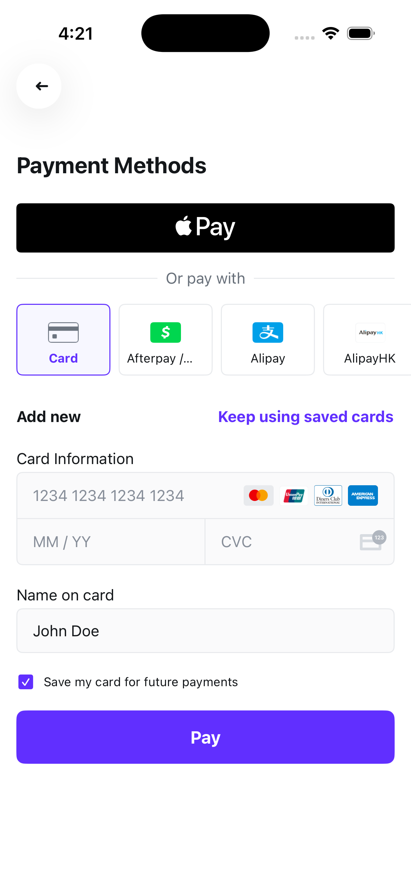
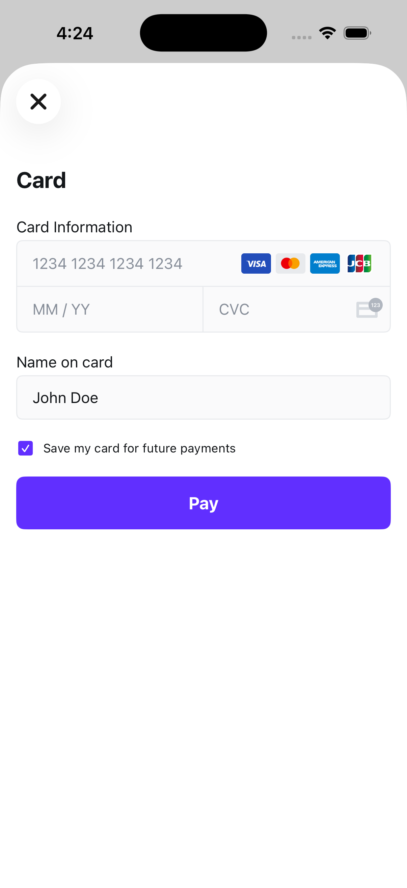
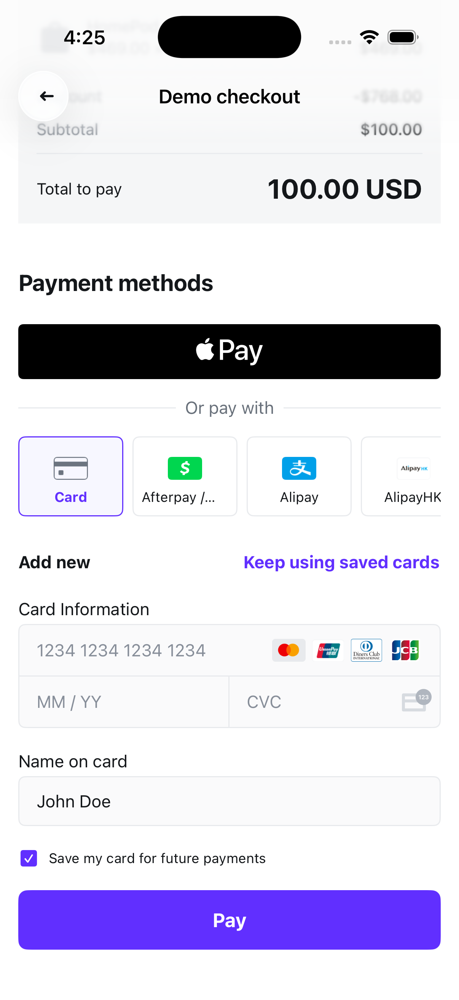
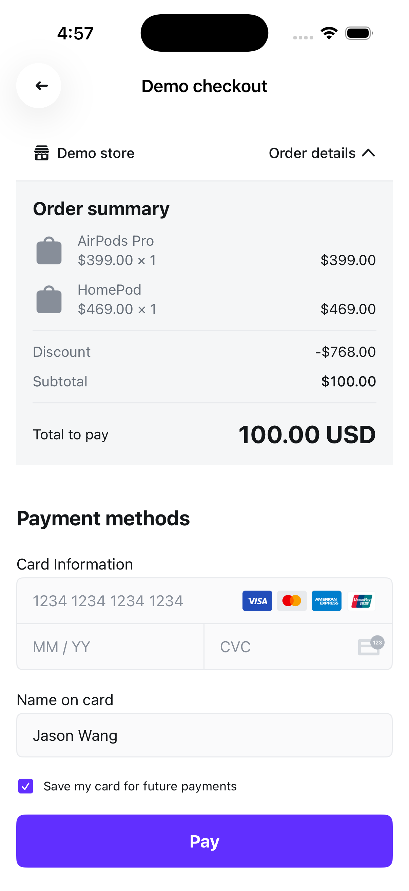
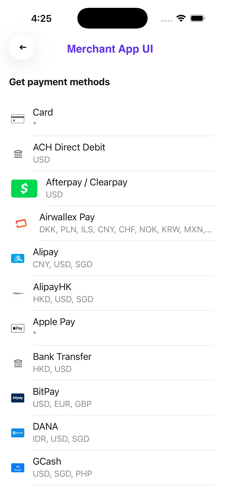
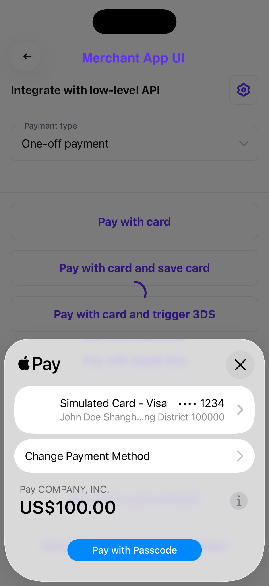
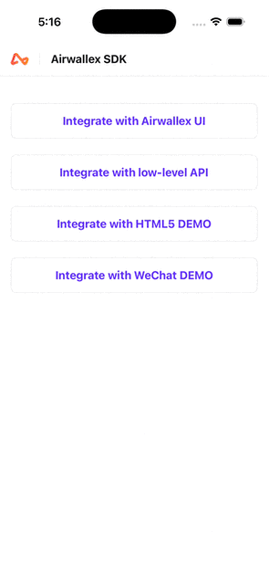
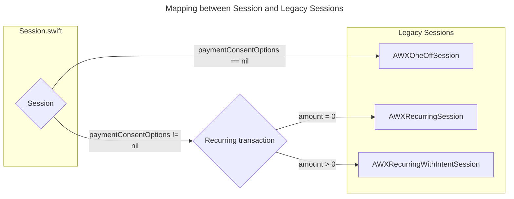
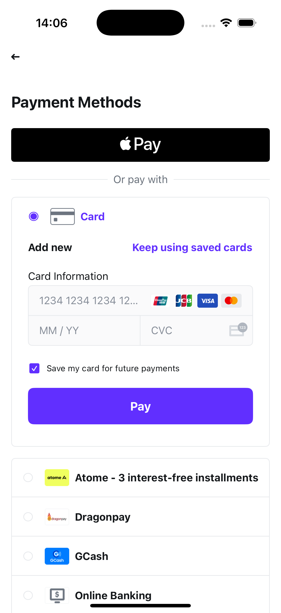
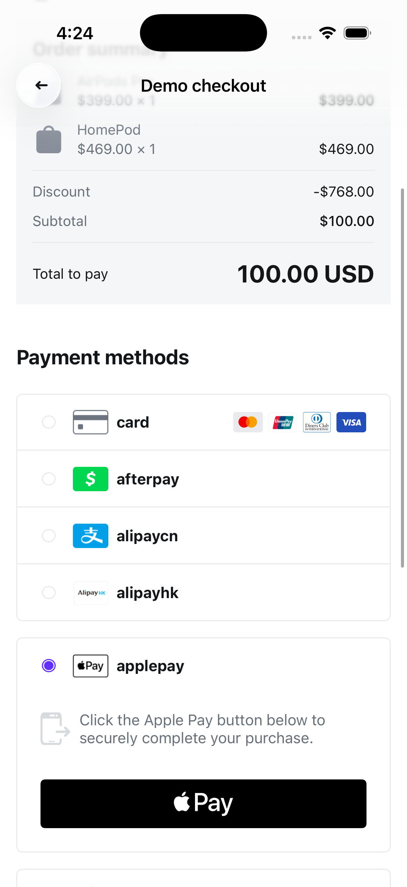

# Airwallex iOS SDK

[English](README.md) | [中文](README_zh_CN.md)


[](https://cocoapods.org)

## 概述

Airwallex iOS SDK 可将支付方式集成到您的 iOS 应用中。您可以在现有结账流程上使用预构建的原生 UI，也可以基于 Low-level API 自行构建自定义 UI。

支持的本地化语言：英语、简体中文、繁体中文、法语、德语、日语、韩语、葡萄牙语（葡萄牙）、葡萄牙语（巴西）、俄语、西班牙语、泰语。

## 支持的支付方式

| 类别 | 方式 | 备注 |
|------|------|------|
| 银行卡 | Visa, Mastercard, UnionPay, Discover, JCB, Diners Club, Amex | 使用 Low-level API 集成时需要 PCI-DSS 合规 |
| Apple Pay | Apple Pay | [配置](#apple-pay) |
| 电子钱包 | 支付宝、支付宝香港、DANA、GCash、Kakao Pay、Touch 'n Go、微信支付等，[更多](https://www.airwallex.com/docs/payments__payment-methods__payment-methods-overview) | |

## 集成选项

选择最适合您需求的集成方式：

| 选项 | 描述 | 多种支付方式 | 单一支付方式 |
|------|------|----------|----------|
| [UI 集成 - HPP（托管支付页面）](#ui-集成---hpp托管支付页面) | 启动完整的、由 SDK 管理的支付流程，包含预构建的支付方式选择、卡输入和结账页面。支持自定义主题和深色模式。**推荐大多数场景使用。** |  |  |
| [UI 集成 - 嵌入式](#ui-集成---嵌入式) | 使用 UIKit 将 Airwallex 的 `AWXPaymentElement` 直接嵌入到您自己的视图层级中。您可以完全控制宿主布局和导航，同时利用 SDK 的支付 UI 组件。 |  |  |
| [Low-level API 集成](#low-level-api-集成) | 使用 SDK 的核心 API 构建完全自定义的支付 UI。直接访问支付方式检索、卡片令牌化、支付确认和 consent 管理。 |  |  |

## 目录

- [开始集成](#开始集成)
- [要求](#要求)
- [示例项目](#示例项目)
- [集成步骤](#集成步骤)
  - [安装](#安装)
    - [Swift Package Manager](#swift-package-manager)
    - [CocoaPods](#cocoapods)
  - [必要设置](#必要设置)
    - [Customer ID](#customer-id)
    - [创建支付意图对象](#创建支付意图对象)
    - [设置客户端密钥](#设置客户端密钥)
    - [创建 Session](#创建-session)
  - [可选设置](#可选设置)
    - [微信支付](#微信支付)
    - [Apple Pay](#apple-pay)
  - [UI 集成 - HPP（托管支付页面）](#ui-集成---hpp托管支付页面)
    - [启动完整支付列表（推荐）](#启动完整支付列表推荐)
    - [仅展示卡支付](#仅展示卡支付)
    - [按名称启动支付方式](#按名称启动支付方式)
    - [配置选项](#配置选项)
    - [选择支付 UI 语言](#选择支付-ui-语言)
    - [处理支付结果](#处理支付结果)
  - [UI 集成 - 嵌入式](#ui-集成---嵌入式)
    - [创建嵌入式支付列表](#创建嵌入式支付列表)
    - [创建嵌入式卡支付组件](#创建嵌入式卡支付组件)
    - [配置选项](#配置选项-1)
    - [处理支付组件事件](#处理支付组件事件)
  - [Low-level API 集成](#low-level-api-集成)
    - [创建 PaymentSessionHandler](#创建-paymentsessionhandler)
    - [使用卡支付](#使用卡支付)
    - [使用保存的卡支付](#使用保存的卡支付)
    - [使用 Apple Pay 支付](#使用-apple-pay-支付)
    - [使用跳转支付](#使用跳转支付)
    - [处理支付结果](#处理支付结果-1)
- [贡献](#贡献)

## 开始集成

请按照[集成指南](#集成步骤)并参考[示例项目](#示例项目)，快速使用 Airwallex iOS SDK 接入支付。

> [!TIP]
> 从旧版 SDK 升级时，请参考[迁移文档](MIGRATION.md)。

## 要求

- iOS 13.0+
- Xcode 15.4+（对于旧版本的 Xcode，请参考 5.4.3 版本）

## 示例项目



示例应用（Examples）可在最新 Xcode 上运行。请按以下步骤操作：

1. 克隆源代码：

```bash
git clone git@github.com:airwallex/airwallex-payment-ios.git
```

2. 安装依赖并打开项目。请先安装 CocoaPods，然后在项目目录中运行：

```bash
pod install
```

> [!TIP]
> 更新初始化设置（可选）
> - 编辑 `Examples/Keys` 文件夹中的 `Keys.json`。
> - 构建并运行 `Examples` scheme。
>
> `Keys.json` 用于提供 Examples 项目的默认设置，您可以随时通过应用内设置页面修改。

## 集成步骤

### 安装

#### Swift Package Manager

Airwallex iOS SDK 支持通过 Swift Package Manager 集成。请按以下步骤操作：

1. [按照 Apple 的指南添加包依赖](https://developer.apple.com/documentation/xcode/adding_package_dependencies_to_your_app)。
2. 使用包地址：`https://github.com/airwallex/airwallex-payment-ios`
3. 选择 **6.1.1** 或更高版本。

添加 `Airwallex` 可集成除微信支付外的全部组件，也可以按需添加：

- `AirwallexPaymentSheet`：UI 集成
- `AirwallexPayment`：low-level API 集成
- `AirwallexWeChatPay`：微信支付（如需支持微信支付必须添加）

**包大小**

| 集成方式 | 包含的组件 | IPA 增加大小 |
|----------|------------|-------------:|
| Low-level API | AirwallexCore <br> AirwallexPayment | 0.4 MB |
| UI | AirwallexCore <br> AirwallexPayment <br> AirwallexPaymentSheet | 1.3 MB |
| 全部组件 | AirwallexCore <br> AirwallexPayment <br> AirwallexPaymentSheet <br> AirwallexWeChatPay | 1.5 MB |

> 上述体积增长来自通过 Swift Package Manager 集成 Airwallex SDK 后，App Thinning Size Report 中的 compressed app size。

#### CocoaPods

Airwallex iOS SDK 也支持通过 [CocoaPods](https://cocoapods.org/) 集成。

添加 `Airwallex` 可集成除微信支付外的全部组件：

```ruby
pod 'Airwallex', '~> 6.7.0'
```

也可以只引入需要的 `subspec`：

```ruby
pod 'Airwallex/AirwallexPaymentSheet' # UI 集成
pod 'Airwallex/AirwallexPayment' # low-level API 集成
pod 'Airwallex/AirwallexWeChatPay' # 微信支付（如需支持必须添加）
```

然后运行：

```bash
pod install
```
### 必要设置

应用启动时，使用 `mode` 配置 SDK：

```swift
Airwallex.setMode(.demoMode) // .demoMode, .previewMode, .stagingMode, .productionMode
```

#### Customer ID

请在服务器端为用户生成或检索 customer ID。接口说明见 [Airwallex API 文档](https://www.airwallex.com/docs/api#/Payment_Acceptance/Customers/)。

> [!NOTE]
> 如果应用不需要签约周期/非周期扣款，也不需要在付款时存卡，可以跳过此步骤。

#### 创建支付意图对象

所有交易都需要创建 payment intent。请在**服务器端**创建，再将其返回给移动端。

接口说明见 [Airwallex API 文档](https://www.airwallex.com/docs/api#/Payment_Acceptance/Payment_Intents/)。

调用 `payment_intents/create` 时：

- **amount = 0**：仅签约周期/非周期扣款，不扣款
- **amount > 0**：签约的同时进行扣款
- 如需签约或付款时存卡，请提供 `customer_id`

#### 设置客户端密钥

如果使用 `Session` 对象，无需手动更新客户端密钥，SDK 会自动处理。

> [!NOTE]
> 如果仍使用已废弃的 `AWXOneOffSession`、`AWXRecurringSession` 和 `AWXRecurringWithIntentSession`，请参考 [6.1.9 版本集成文档](https://github.com/airwallex/airwallex-payment-ios/tree/6.1.9?tab=readme-ov-file#integration) 主动更新 `clientSecret`。

#### 创建 Session

6.2.0 引入的 `Session` 简化了集成方式。建议使用 `Session`，替代已废弃的 `AWXOneOffSession`、`AWXRecurringSession` 和 `AWXRecurringWithIntentSession`。

**方式 1：使用预先创建的 payment intent 初始化**

```swift
let paymentConsentOptions = if /* 单次扣款 */ {
    nil
} else {
    /* 周期/非周期扣款 */
    PaymentConsentOptions(
        nextTriggeredBy: ".customer/.merchant",
        merchantTriggerReason: "nil/.scheduled/.unscheduled/...."
    )
}
let session = Session(
    paymentIntent: paymentIntent, // 在服务器上创建的 payment intent
    countryCode: "Your country code",
    applePayOptions: applePayOptions, // 如需支持 Apple Pay 则必填
    autoCapture: true, // 仅适用于卡支付。为 true 时，授权成功后立即捕获
    billing: billing, // 预填账单地址
    paymentConsentOptions: paymentConsentOptions, // 周期/非周期扣款信息
    requiredBillingContactFields: [.name, .email], // 自定义卡支付账单联系字段
    returnURL: "myapp://payment/return" // App 返回 URL
)
```

**方式 2：使用 PaymentIntentProvider 初始化**

使用 `PaymentIntentProvider` 可将 payment intent 的创建延迟到支付确认前，或延迟到需要 `clientSecret` 调用 Airwallex 接口时。

```swift
// 1. 实现 PaymentIntentProvider
class MyPaymentIntentProvider: NSObject, PaymentIntentProvider {
    let amount = NSDecimalNumber(string: "99.99")
    let currency: String = "USD"
    let customerId: String? = "customer_123"

    func createPaymentIntent() async throws -> AWXPaymentIntent {
        // 调用后端创建 payment intent
        let response = try await MyBackendAPI.createPaymentIntent(
            amount: amount,
            currency: currency,
            customerId: customerId
        )
        return response.paymentIntent
    }
}

// 2. 使用 provider 创建 session
let provider = MyPaymentIntentProvider()
let session = Session(
    paymentIntentProvider: provider, // payment intent 将在需要时创建
    countryCode: "US"
)
```

> [!NOTE]
> 下一个大版本发布前，SDK 仍支持 `AWXOneOffSession`、`AWXRecurringSession` 和 `AWXRecurringWithIntentSession`。具体步骤见 [6.1.9 集成文档](https://github.com/airwallex/airwallex-payment-ios/tree/6.1.9?tab=readme-ov-file#integration)。


```mermaid
---
title: Mapping between Session and Legacy Sessions
---
flowchart LR
    A{Session}
    B1[AWXOneOffSession]
    B2{Recurring transaction}
    C1[AWXRecurringSession]
    C2[AWXRecurringWithIntentSession]

subgraph Session.swift
    A
end 

A -- paymentConsentOptions == nil --> B1
A -- paymentConsentOptions != nil --> B2

subgraph Legacy Sessions
    B1;C1;C2
end

B2 -- amount = 0 --> C1
B2 -- amount > 0 --> C2
```

### 可选设置

#### 微信支付

- 添加 `AirwallexWeChatPay`（Swift Package Manager）或 `Airwallex/AirwallexWeChatPay`（CocoaPods）依赖。
- 按照[微信 iOS 接入指南](https://developers.weixin.qq.com/doc/oplatform/en/Mobile_App/Access_Guide/iOS.html)配置 `WechatOpenSDK`。

```swift
class AppDelegate: UIResponder, UIApplicationDelegate {
    func application(_ application: UIApplication, didFinishLaunchingWithOptions launchOptions: [UIApplication.LaunchOptionsKey: Any]?) -> Bool {
        WXApi.registerApp("WeChat app ID", universalLink: "universal link of your app")
        return true
    }

    func application(_ app: UIApplication, open url: URL, options: [UIApplication.OpenURLOptionsKey : Any] = [:]) -> Bool {
        return WXApi.handleOpen(url, delegate: self)
    }
}

extension AppDelegate: WXApiDelegate {
    func onResp(_ resp: BaseResp) {
        if let response = resp as? PayResp {
            switch response.errCode {
                // handle payment result
            }
        }
    }
}
```

完成支付后，微信会跳回商户应用并回调 `onResp()`。请持续监听该回调，并在商户服务端收到通知后查询 payment intent 状态。

> [!NOTE]
> 微信支付使用基于 `WechatOpenSDK` 2.0.4 重新构建的动态框架 `WechatOpenSDKDynamic.xcframework`，目的是：
> 1. 从 SPM Target `AirwallexWeChatPay` 中移除不安全的 linker flag `-ObjC`、`-all_load`
> 2. 去掉现代应用不再需要的 `armv7` 和 `i386` 架构

#### Apple Pay

Airwallex iOS SDK 支持 Apple Pay。

- 请先在应用中正确配置 Apple Pay。步骤见 Apple [官方文档](https://developer.apple.com/documentation/passkit/apple_pay/setting_up_apple_pay)。
- 确保 Airwallex 账户已启用 Apple Pay。
- 使用[商户标识符](https://developer.apple.com/documentation/passkit/apple_pay/setting_up_apple_pay) 创建 `AWXApplePayOptions`，并设置到 `session.applePayOptions`。

可以限制可用网络或附加交易信息。全部配置项见 `AWXApplePayOptions.h`。
```swift
let options = AWXApplePayOptions(merchantIdentifier: applePayMerchantId)
options.additionalPaymentSummaryItems = [
    .init(label: "goods", amount: 10),
    .init(label: "tax", amount: 1)
]
options.merchantCapabilities = [.threeDSecure, .debit]
options.requiredBillingContactFields = [.postalAddress]
options.supportedCountries = ["AU"]
options.totalPriceLabel = "COMPANY, INC."

let session = Session(
    //  ...
    applePayOptions: options // required for Apple Pay
)
```

> [!IMPORTANT]
> 目前支持的 Apple Pay 支付网络：
> - Visa
> - Mastercard
> - China UnionPay
> - Maestro
> - Amex
> - Discover
> - JCB
>
> 当前版本不支持 Coupon。


### UI 集成 - HPP（托管支付页面）

#### 启动完整支付列表（推荐）

> [!NOTE]
> 这是**推荐**用法：使用预构建 UI 收集支付与账单信息并确认支付。

请添加 `Airwallex` 或 `AirwallexPaymentSheet` 依赖。结账时使用 [AWXUIContext](https://airwallex.github.io/airwallex-payment-ios/6.7.0/documentation/airwallex/awxuicontext/) 展示支付方式列表。
```swift
let configuration = AWXUIContext.Configuration()
configuration.layout = .tab // or .accordion
configuration.launchStyle = .push // or .present

AWXUIContext.launchPayment(
    from: "hosting view controller which also handles AWXPaymentResultDelegate",
    session: "The session created above",
    configuration: configuration
)
```

我们提供 `tab` 和 `accordion` 两种支付列表布局：

<p align="left">


</p>

#### 仅展示卡支付
```swift
let configuration = AWXUIContext.Configuration()
configuration.elementType = .addCard
configuration.supportedCardBrands = [.visa, .mastercard, .unionPay]

AWXUIContext.launchPayment(
    from: "hosting view controller which also handles AWXPaymentResultDelegate",
    session: "The session created above",
    configuration: configuration
)
```

> [!TIP]
> 如需仅展示卡支付并仍支持已保存的卡，可通过 `session.paymentMethods = [AWXCardKey]` 过滤：
```swift
let session = Session(...)
session.paymentMethods = [AWXCardKey]

AWXUIContext.launchPayment(
    from: "hosting view controller which also handles AWXPaymentResultDelegate",
    session: session,
    configuration: AWXUIContext.Configuration()
)
```
#### 按名称启动支付方式
```swift
let configuration = AWXUIContext.Configuration()
configuration.elementType = .component
configuration.paymentMethodName = "payment method name"

AWXUIContext.launchPayment(
    from: "hosting view controller",
    session: "The session created above",
    paymentResultDelegate: "object handles AWXPaymentResultDelegate",
    configuration: configuration
)
```
> [!TIP]
> 可用的支付方式名称见 [Airwallex API](https://www.airwallex.com/docs/api#/Payment_Acceptance/Config/_api_v1_pa_config_payment_method_types/get)。

#### 配置选项

| 属性 | 描述 | 默认值 |
|------|------|--------|
| `elementType` | `.paymentSheet`（所有支付方式）、`.addCard`（仅卡支付）或 `.component`（单个支付方式） | `.paymentSheet` |
| `paymentMethodName` | 支付方式名称（`.component` 时必填） | `nil` |
| `layout` | `.tab` 或 `.accordion`（仅适用于 `.paymentSheet`） | `.tab` |
| `launchStyle` | `.push` 或 `.present` | `.push` |
| `supportedCardBrands` | 接受的卡品牌（仅适用于 `.addCard`） | 所有可用品牌 |
| `applePayButton` | 自定义 Apple Pay 按钮外观（如 `buttonType`、`disableCardArt`） | — |
| `checkoutButton` | 自定义结账按钮（如 `title`） | — |

#### 选择支付 UI 语言

在展示支付列表或创建嵌入式支付组件之前，请设置 session 的 `lang`。请使用符合 BCP-47 标准的语言标识符来控制 SDK UI 的语言。

```swift
session.lang = "fr"
```

SDK 会根据自身支持的语言解析 `"ja-JP"` 和 `"zh-Hant"` 等地区或文字变体。`nil` 或空值会使用应用的首选本地化语言，不支持的值会回退到英语。更改 `lang` 后，需要重新创建支付列表或嵌入式支付组件。

#### 处理支付结果

在 `AWXPaymentResultDelegate` 的回调中处理支付结果。
```swift
func paymentViewController(_ controller: UIViewController?, didCompleteWith status: AirwallexPaymentStatus, error: Error?) {
    // call back for status success/in progress/ failure / cancel
}
```

> [!TIP]
> 如果在支付过程中创建了 consent，您可以通过此可选函数以获取 consent ID 以供后续使用。
```swift
func paymentViewController(_ controller: UIViewController?, didCompleteWithPaymentConsentId paymentConsentId: String) {
    // To do anything with this ID.
}
```

### UI 集成 - 嵌入式

`AWXPaymentElement` 可将支付 UI 嵌入到您自己的视图层级中。
与以视图控制器展示完整支付页的 `AWXUIContext.launchPayment()` 不同，`AWXPaymentElement` 返回一个可放在任意布局位置的 `UIView`。

请添加 `Airwallex` 或 `AirwallexPaymentSheet` 依赖。

嵌入式支付列表同样支持 tab 和 accordion 布局：

<p align="left">


</p>

> [!NOTE]
> - 嵌入式视图需要 Auto Layout 约束来正确调整尺寸。
> - 视图高度会随内容自动更新。
> - 键盘处理由宿主应用负责。

#### 创建嵌入式支付列表

在您自己的视图层级中展示可用的支付方式列表。

```swift
let configuration = AWXPaymentElement.Configuration()
configuration.layout = .tab // or .accordion

let element = try await AWXPaymentElement.create(
    session: session,
    delegate: self, // AWXPaymentElementDelegate
    configuration: configuration
)

// 将 element 的视图添加到您的视图层级中
let paymentView = element.view
paymentView.translatesAutoresizingMaskIntoConstraints = false
containerView.addSubview(paymentView)
```

#### 创建嵌入式卡支付组件

仅展示卡支付表单，用于添加新卡。

```swift
let configuration = AWXPaymentElement.Configuration()
configuration.elementType = .addCard
configuration.supportedCardBrands = [.visa, .mastercard, .unionPay] // 默认为所有可用的卡品牌

let element = try await AWXPaymentElement.create(
    session: session,
    delegate: self, // AWXPaymentElementDelegate
    configuration: configuration
)

// 将 element 的视图添加到您的视图层级中
let paymentView = element.view
paymentView.translatesAutoresizingMaskIntoConstraints = false
containerView.addSubview(paymentView)
```

#### 配置选项

| 属性 | 描述 | 默认值 |
|------|------|--------|
| `elementType` | `.paymentSheet`（所有支付方式）或 `.addCard`（仅卡支付） | `.paymentSheet` |
| `layout` | `.tab` 或 `.accordion`（仅适用于 `.paymentSheet`） | `.tab` |
| `supportedCardBrands` | 接受的卡品牌（仅适用于 `.addCard`） | 所有可用品牌 |
| `applePayButton` | 自定义 Apple Pay 按钮外观（如 `showsAsPrimaryButton`、`buttonType`、`disableCardArt`） | — |
| `checkoutButton` | 自定义结账按钮（如 `title`） | — |
| `appearance.tintColor` | 支付组件中使用的主要品牌颜色 | SDK 默认值 |

#### 处理支付组件事件

实现 `AWXPaymentElementDelegate` 以接收嵌入式支付组件的生命周期回调。

```swift
extension YourViewController: AWXPaymentElementDelegate {
    // 必须实现 - 支付完成时调用
    func paymentElement(
        _ element: AWXPaymentElement,
        didCompleteFor paymentMethod: String,
        with status: AirwallexPaymentStatus,
        error: Error?
    ) {
        // call back for status success/in progress/ failure / cancel
    }

    // 可选 - 显示/隐藏您自己的加载指示器
    func paymentElement(
        _ element: AWXPaymentElement,
        onProcessingStateChangedFor paymentMethod: String,
        isProcessing: Bool
    ) {
        // 显示或隐藏加载指示器
    }

    // 可选 - 创建 payment consent 时调用
    func paymentElement(
        _ element: AWXPaymentElement,
        didCompleteFor paymentMethod: String,
        withPaymentConsentId paymentConsentId: String
    ) {
        // 保存 consent ID 以供后续使用
    }

    // 可选 - 将验证失败的输入框滚动到可见区域
    func paymentElement(
        _ element: AWXPaymentElement,
        validationFailedFor paymentMethod: String,
        invalidInputView: UIView
    ) {
        let rect = invalidInputView.convert(invalidInputView.bounds, to: scrollView)
        scrollView.scrollRectToVisible(rect, animated: true)
    }
}
```

### Low-level API 集成

您也可以基于 Low-level API 构建自定义 UI。

> [!NOTE]
> 请添加 `Airwallex` 或 `AirwallexPayment` 依赖，并完成[必要设置](#必要设置)中的全部步骤。自定义 UI 所需信息见 [Airwallex API 文档](https://www.airwallex.com/docs/api#/Payment_Acceptance)。

#### 创建 PaymentSessionHandler

[PaymentSessionHandler](https://airwallex.github.io/airwallex-payment-ios/6.7.0/documentation/airwallex/paymentsessionhandler/) 是 API 集成的核心。

```swift
let paymentSessionHandler = PaymentSessionHandler(
    session: "The session created above", 
    viewController: "hosting view controller which also handles AWXPaymentResultDelegate"
)
self.paymentSessionHandler = paymentSessionHandler
```

> [!TIP]
> 初始化后，请将 `paymentSessionHandler` 保存在与视图生命周期绑定的对象中。

#### 使用卡支付
```swift
// Confirm intent with card and billing
paymentSessionHandler.startCardPayment(
    with: "The AWXCard object collected by your custom UI",
    billing: "The AWXPlaceDetails object collected by your custom UI"
)
```

#### 使用保存的卡支付

- 使用 `AWXPaymentConsent` 支付： 
```swift
paymentSessionHandler.startConsentPayment(with: "payment consent")
```

- 使用 consent ID 支付 — 仅当卡以**网络令牌**形式保存时：
```swift
paymentSessionHandler.startConsentPayment(withId: "consent ID")
```

#### 使用 Apple Pay 支付

> [!IMPORTANT]
> 请先完成 [Apple Pay 设置](#apple-pay)。 
```swift
paymentSessionHandler.startApplePay()
```

#### 使用跳转支付

> [!IMPORTANT]
> 请在 `additionalInfo` 中提供 `/api/v1/pa/config/payment_method_types/${payment method name}` 中的全部必填字段。
```swift
paymentSessionHandler.startRedirectPayment(
    with: "payment method name",
    additionalInfo: "all required information"
)
```

#### 处理支付结果

在 `AWXPaymentResultDelegate` 的回调中处理支付结果。
```swift
func paymentViewController(_ controller: UIViewController?, didCompleteWith status: AirwallexPaymentStatus, error: Error?) {
    // call back for status success/in progress/ failure / cancel
}
```

> [!TIP]
> 如果在支付过程中创建了 consent，您可以通过此可选函数以获取 consent ID 以供后续使用。
```swift
func paymentViewController(_ controller: UIViewController?, didCompleteWithPaymentConsentId paymentConsentId: String) {
    // To do anything with this ID.
}
```

## 贡献

我们欢迎任何形式的贡献，包括新功能、缺陷修复和文档改进。最直接的方式是提交 Pull Request。如发现问题或有疑问，也可以提交 Issue。
