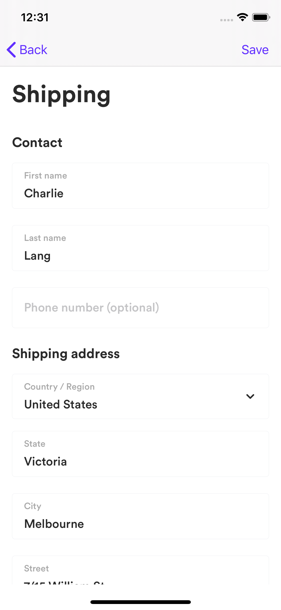

# Airwallex iOS SDK


[](https://github.com/Carthage/Carthage)
[](https://cocoapods.org)

Airwallex iOS SDK是一个框架，用于通过Airwallex在您的应用程序中集成轻松，快速和安全的付款。它提供了简单的功能，可以将敏感的信用卡数据直接发送到Airwallex，还提供了功能强大的可自定义界面，用于收集用户付款明细。

<p align="center">



</p>

开始使用我们的集成指南和示例项目。

目录
=================

<!--ts-->
   * [要求](#要求)
   * [整合](#整合)
      * [CocoaPods](#cocoapods)
	  * [Carthage](#carthage)
	  * [Swift](#swift)
      * [基本整合](#基本整合)
      * [自定义用法](#自定义用法)
      * [设置微信支付](#设置微信支付)
   * [例子](#例子)
   * [贡献](#贡献)
<!--te-->

## 要求
Airwallex iOS SDK需要Xcode 10.0或更高版本，并且与面向iOS 10或更高版本的应用程序兼容。

## 整合

### CocoaPods

Airwallex可通过[CocoaPods](https://cocoapods.org/) 或者 [Carthage](https://github.com/Carthage/Carthage)整合。

如果尚未安装，请安装最新版本的[CocoaPods](https://cocoapods.org/).
如果您还没有`Podfile`, 请运行以下命令来创建一个:
```ruby
pod init
```
将此行添加到您的`Podfile`中:
```ruby
pod 'Airwallex'
```
运行以下命令
```ruby
pod install
```
不要忘记从现在开始使用`.xcworkspace`文件而不是`.xcodeproj`文件来打开项目。
以后如果要更新到最新版本的SDK，只需运行：
```ruby
pod update Airwallex
```

### Carthage

```ogdl
github "airwallex/airwallex-payment-ios"
```

### Swift

即使`Airwallex`是用Objective-C编写的，它也可以轻松地用在Swift中。如果您使用[CocoaPods](https://cocoapods.org/)，请将以下行添加到[Podfile](https://guides.cocoapods.org/using/using-cocoapods.html)中：

```ruby
use_frameworks!
```

### 基本整合

启动应用时，请先配置SDK的`baseURL`.

```objective-c
[Airwallex setDefaultBaseURL:[NSURL URLWithString:@”Airwallex payment base URL”]];
```

- 创建payment intent

当客户想要结帐时，您应该在服务器端创建payment intent，然后将id和client_secret传递给移动端，以所选的付款方式确认payment intent。

- 处理付款流程

在结帐界面中，添加一个按钮，让客户输入或更改他们的付款方式。点击后，用`AWUIContext`显示付款流程。

```objective-c
AWUIContext *context = [AWUIContext sharedContext];
context.delegate = ”The target to handle AWPaymentResultDelegate protocol”;
context.hostViewController = “The host viewController present or push the payment UIs”;
context.paymentIntent = “The payment intent merchant provides”;
context.shipping = “The shipping address merchant provides”;
[context presentPaymentFlow];
```

- 处理付款结果

用户成功完成付款或出现错误后，您需要处理付款结果。

```objective-c
/**
 A delegate which handles checkout results.
 */
@protocol AWPaymentResultDelegate <NSObject>
 
/**
 This method is called when the user has completed the checkout.
 
 @param controller The controller handling payment result.
 @param status The status of checkout result.
 @param error The error if checkout failed.
 */
- (void)paymentViewController:(UIViewController *)controller didFinishWithStatus:(AWPaymentStatus)status error:(nullable NSError *)error;
 
/**
 This method is called when the user has completed the checkout with wechat pay.
 
 @param controller The controller handling payment result.
 @param response The wechat object.
 */
- (void)paymentViewController:(UIViewController *)controller nextActionWithWeChatPaySDK:(AWWeChatPaySDKResponse *)response;
 
@end
```

### 自定义用法

- 自定义物流信息的用法

使用`AWUIContext`得到`AWShippingViewController`的实例并显示包含在`UINavigationController`里。

```objective-c
AWShippingViewController *controller = [AWUIContext shippingViewController];
controller.delegate = "The target to handle AWShippingViewControllerDelegate protocol";
controller.shipping = "The shipping address merchant provides";
UINavigationController *navigationController = [[UINavigationController alloc] initWithRootViewController:controller];
[self presentViewController:navigationController animated:YES completion:nil];
```

- 处理物流信息的结果

```objective-c
/**
 A delegate which handles selected shipping.
 */
@protocol AWShippingViewControllerDelegate <NSObject>
 
/**
 This method is called when a shipping has been saved.
 
 @param controller The shipping view controller.
 @param shipping The selected shipping.
 */
- (void)shippingViewController:(AWShippingViewController *)controller didEditShipping:(AWPlaceDetails *)shipping;
 
@end
```

- 自定义卡片创建的用法

使用`AWUIContext`得到`AWCardViewController`的实例并显示包含在`UINavigationController`里。

```objective-c
AWCardViewController *controller = [AWUIContext newCardViewController];
controller.delegate = "The target to handle AWCardViewControllerDelegate protocol";
controller.customerId = "The customer id merchant provides";
controller.sameAsShipping = YES;
controller.shipping = "The shipping address merchant provides";
UINavigationController *navigationController = [[UINavigationController alloc] initWithRootViewController:controller];
[self presentViewController:navigationController animated:YES completion:nil];
```

- 处理卡片创建的结果

```objective-c
/**
 A delegate which handles card creation.
 */
@protocol AWCardViewControllerDelegate <NSObject>
 
/**
 This method is called when a card has been created and saved to backend.
 
 @param controller The new card view controller.
 @param paymentMethod The saved card.
 */
- (void)cardViewController:(AWCardViewController *)controller didCreatePaymentMethod:(AWPaymentMethod *)paymentMethod;
 
@end
```

- 自定义付款明细的用法

使用`AWUIContext`得到`AWPaymentViewController`的实例并显示包含在`UINavigationController`里。

```objective-c
AWPaymentViewController *controller = [AWUIContext paymentDetailViewController];
controller.delegate = "The target to handle AWPaymentResultDelegate protocol";
controller.paymentIntent = "The payment intent merchant provides";
controller.paymentMethod = "The payment method merchant provides";
UINavigationController *navigationController = [[UINavigationController alloc] initWithRootViewController:controller];
[self presentViewController:navigationController animated:YES completion:nil];
```

- 自定义确认payment intent的用法

在使用`AWAPIClient`发送请求之前，请设置client secret。

```objective-c
[AWAPIClientConfiguration sharedConfiguration].clientSecret = "The client secret merchant provides";
```

```objective-c
AWConfirmPaymentIntentRequest *request = [AWConfirmPaymentIntentRequest new];
request.intentId = "The payment intent id merchant provides";
request.paymentMethod = "The payment method merchant provides";
AWPaymentMethodOptions *options = [AWPaymentMethodOptions new];
options.autoCapture = YES;
options.threeDsOption = NO;
request.options = options;
request.requestId = NSUUID.UUID.UUIDString;

AWAPIClient *client = [[AWAPIClient alloc] initWithConfiguration:[AWAPIClientConfiguration sharedConfiguration]];
[client send:request handler:^(id<AWResponseProtocol>  _Nullable response, NSError * _Nullable error) {
	if (error) {
		return;
	}
 
	AWConfirmPaymentIntentResponse *result = (AWConfirmPaymentIntentResponse *)response;
	// Handle the payment result.
}];
```

### 设置微信支付

注意：您可以按照此官方指南来设置[WeChat In-App Pay](https://pay.weixin.qq.com/wiki/doc/api/wxpay/pay/In-AppPay/chapter6_2.shtml).

1. 商家成功在微信开放平台上申请了应用后，平台将向商家提供唯一的APPID。在Xcode中创建项目时，开发人员应在“URL Schemes”字段中输入APPID值
2. 在调用API之前，您应该在微信上注册您的APPID。

```objective-c
[WXApi registerApp:@"Wechat app id" enableMTA:YES];
```

3. 商家的服务器调用统一订单API来创建交易。获取prepay_id并签署相关参数后，交易数据将传输到该应用以开始付款。

```objective-c
- (void)paymentWithWechatPaySDK:(AWWeChatPaySDKResponse *)response
{
	PayReq *request = [[PayReq alloc] init];
	request.partnerId = response.partnerId;
	request.prepayId = response.prepayId;
	request.package = response.package;
	request.nonceStr = response.nonceStr;
	request.timeStamp = response.timeStamp.doubleValue;
	request.sign = response.sign;

	[WXApi sendReq:request];
}
```

4. 付款完成后，微信将重定向到商家的应用程序，并使用onRes()进行回调，然后在通知商家服务器后可以检索payment intent状态，因此请保持监听通知。

```objective-c
- (void)onResp:(BaseResp *)resp
{
	if ([resp isKindOfClass:[PayResp class]]) {
		PayResp *response = (PayResp *)resp;
		switch (response.errCode) {
			case WXSuccess:
				[SVProgressHUD showSuccessWithStatus:@"Succeed to pay"];
				break;
			default:
				[SVProgressHUD showErrorWithStatus:@"Failed to pay"];
				break;
		}
	}
}
```

## 例子

要运行示例项目，应遵循以下步骤。

- 准备

1. 安装Xcode的[最新版本](https://itunes.apple.com/us/app/xcode/id497799835?mt=12).

2. 安装[Bundle](https://bundler.io/)

```ruby
gem install bundler
```

- 克隆源代码

运行以下脚本将该项目克隆到本地磁盘。

```
git clone git@github.com:airwallex/airwallex-payment-ios.git
```

- 安装依赖项并打开项目

1. 进入项目目录

```
cd airwallex-payment-ios
```

2. 安装依赖

```
bundle install
```

```
pod install
```

3. 使用Xcode打开`Airwallex.xcworkspace`或者运行以下脚本。 **确保始终通过work space打开项目**

```
open Airwallex.xcworkspace
```

- 构建配置

有两种配置`Airwallex`和`Examples`。你可以在项目中切换你想要的配置。

`Airwallex`将为开发人员生成框架

`Examples`将构建和运行示例应用程序

- 在iOS设备上运行该应用

从左上方的面板中选择目标设备，然后按键盘上的“ Command + R”（或从顶部菜单栏中的“产品>运行”）在iOS设备上运行此项目。

## 贡献

我们欢迎任何形式的贡献，包括新功能，错误修复和文档改进。最好的贡献方式是提交请求 - 我们将尽快回复您的提交。如果您发现错误或有任何疑问，也可以提交问题。
